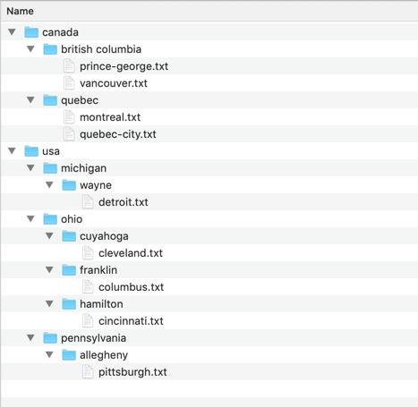

# Introduction to Tools

Welcome to Tech Elevator! This is the first of many exercises you will complete throughout the cohort. The intent of the exercises is to reinforce the concepts you learn everyday and to provide you with the opportunity to practice your new skills.

The Introduction to Tools exercise covers Git and several Unix commands typically used alongside Git. This exercise is intended to help you gain familiarity and confidence in working with the command line inside the Terminal.

## Learning Objectives

After completing this exercise, you should understand:

- How to navigate the directory structure.
- How to identify your current working directory.
- How to display files within a directory.
- How to rename, copy, and move files.
- Common techniques used when working with Git.
- How to push work using Git for review.
- How to use the README file to complete exercises.

## Evaluation Criteria & Functional Requirements

- Directories and files that have been modified, added, removed, moved, or renamed reflect the work that was completed during the exercise.
- All of the questions not marked as optional have been answered. This should be completed for all exercises you work on throughout the cohort.
- The `verify.sh` file prints `22/22 tests pass` to the screen when run from the command line using `sh verify.sh`
- The appropriate commits have been added to Git.

## Tips and Tricks

- When working through exercises at Tech Elevator, you should refer to the README.md files found at the root of each exercise folder for clarification on what is expected for each exercise, the work that needs to be completed, and information related to the concepts you should learn in each exercise. There is also a section that includes helpful tips, tricks, and additional links that might be of value to dig deeper into the concepts discussed for each exercise. **Be sure to make use of the README file as you work through each exercise.**
- Refererence Finder (Mac) or Explorer (PC) for a visual of directory structure created by your script.
- When stuck, check to make sure none of your folder or file names contain any typos.


## Instructions

### Step One: Prepare Your Workspace

- Open a Terminal (Mac) or Git Bash (PC) window.
- Navigate to the folder containing today's exercise.
- In the terminal window, run the `verify.sh` script by using the command `sh verify.sh`. 
    - **Note**: This command will be used to receive feedback if you've completed the exercise successfully. Initially, you should see the following output:

    ```
    ---- VERIFYING  ----

    ❗️ 1. ~/playground does not exist
    ❗️ 2. ~/playground/usa does not exist
    ❗️ 3. ~/playground/canada does not exist
    ❗️ 4. ~/playground/usa/ohio does not exist
    ❗️ 5. ~/playground/usa/pennsylvania does not exist
    ❗️ 6. ~/playground/usa/michigan does not exist
    ❗️ 7. ~/playground/canada/quebec does not exist
    ❗️ 8. ~/playground/canada/british columbia does not exist
    ❗️ 9. ~/playground/usa/ohio/cuyahoga does not exist
    ❗️ 10. ~/playground/usa/ohio/hamilton does not exist
    ❗️ 11. ~/playground/usa/ohio/franklin does not exist
    ❗️ 12. ~/playground/usa/pennsylvania/allegheny does not exist
    ❗️ 13. ~/playground/usa/michigan/wayne does not exist
    ❗️ 14. ~/playground/usa/ohio/cuyahoga/cleveland.txt does not exist
    ❗️ 15. ~/playground/usa/ohio/hamilton/cincinnati.txt does not exist
    ❗️ 16. ~/playground/usa/ohio/franklin/columbus.txt does not exist
    ❗️ 17. ~/playground/usa/pennsylvania/allegheny/pittsburgh.txt does not exist
    ❗️ 18. ~/playground/usa/michigan/wayne/detroit.txt does not exist
    ❗️ 19. ~/playground/canada/quebec/montreal.txt does not exist
    ❗️ 20. ~/playground/canada/quebec/quebec-city.txt does not exist
    ❗️ 21. ~/playground/canada/british columbia/vancouver.txt does not exist
    ❗️ 22. ~/playground/canada/british columbia/prince-george.txt does not exist

    0/22 tests pass
    ```
- Open a second Terminal (Mac) or Git Bash (PC) window and navigate to the home directory by using the command `cd ~`.

### Step Two: Apply the Unix Commands You Learned

Following the below steps, type the appropriate Unix commands to build a directory structure. At any point when you wish to check your progress, rerun `verify.sh` in the first terminal window. 

An image is shown in case you would like to manually verify the changes to your file system in Finder/Explorer.



1. Starting from your home directory, create a new directory called `playground`.
2. Create a new directory at the path `~/playground/usa` (note: `playground` will already exist).
3. Create a new directory at the path `~/playground/canada`.
4. Create a new directory at the path `~/playground/usa/ohio`.
5. Create a new directory at the path `~/playground/usa/pennsylvania`.
6. Create a new directory at the path `~/playground/usa/michigan`.
7. Create a new directory at the path `~/playground/canada/quebec`.
8. Create a new directory at the path `~/playground/canada/british columbia`.
9. Create a new directory at the path `~/playground/usa/ohio/cuyahoga`.
10. Create a new directory at the path `~/playground/usa/ohio/hamilton`.
11. Create a new directory at the path `~/playground/usa/ohio/franklin`.
12. Create a new directory at the path `~/playground/usa/pennsylvania/allegheny`.
13. Create a new directory at the path `~/playground/usa/michigan/wayne`.
14. Create a new file at the path `~/playground/usa/ohio/cuyahoga/cleveland.txt`.
15. Create a new file at the path `~/playground/usa/ohio/cuyahoga/cincinnati.txt` and move it to the directory at `~/playground/usa/ohio/hamilton`.
16. Copy the file from `~/playground/usa/ohio/cuyahoga/cleveland.txt` and place it into the directory at `~/playground/usa/ohio/franklin`. Change the name of the file to `columbus.txt`.
17. Create a new file at the path `~/playground/usa/pennsylvania/allegheny/pittsburgh.txt`.
18. Create a new file at the path `~/playground/usa/michigan/wayne/detroit.txt`.
19. Create a new file at the path `~/playground/canada/quebec/montreal.txt`.
20. Create a new file at the path `~/playground/canada/quebec/quebec-city.txt`.
21. Create a new file at the path `~/playground/canada/british columbia/vancouver.txt`.
22. Create a new file at the path `~/playground/canada/british columbia/prince-george.txt`.


### Step Three: Submit Your Exercise Using Git Commands

After you have verified your progress by running `sh verify.sh` and seen the following output, it will be time to submit your work.

```
---- VERIFYING  ----

✅ 1. ~/playground exists
✅ 2. ~/playground/usa exists
✅ 3. ~/playground/canada exists
✅ 4. ~/playground/usa/ohio exists
✅ 5. ~/playground/usa/pennsylvania exists
✅ 6. ~/playground/usa/michigan exists
✅ 7. ~/playground/canada/quebec exists
✅ 8. ~/playground/canada/british columbia exists
✅ 9. ~/playground/usa/ohio/cuyahoga exists
✅ 10. ~/playground/usa/ohio/hamilton exists
✅ 11. ~/playground/usa/ohio/franklin exists
✅ 12. ~/playground/usa/pennsylvania/allegheny exists
✅ 13. ~/playground/usa/michigan/wayne exists
✅ 14. ~/playground/usa/ohio/cuyahoga/cleveland.txt exists
✅ 15. ~/playground/usa/ohio/hamilton/cincinnati.txt exists
✅ 16. ~/playground/usa/ohio/franklin/columbus.txt exists
✅ 17. ~/playground/usa/pennsylvania/allegheny/pittsburgh.txt exists
✅ 18. ~/playground/usa/michigan/wayne/detroit.txt exists
✅ 19. ~/playground/canada/quebec/montreal.txt exists
✅ 20. ~/playground/canada/quebec/quebec-city.txt exists
✅ 21. ~/playground/canada/british columbia/vancouver.txt exists
✅ 22. ~/playground/canada/british columbia/prince-george.txt exists

22/22 tests pass

Congratulations! All tests are passing.
Continue on to Step 3 in the README to submit your exercise.
```

The `submission.txt` file that was generated for you will be saved and pushed using Git. Type the following Git commands to submit your work.

```
$ git status
$ git add -A
$ git commit -m "Submitting Week 1 Day 1 exercise"
$ git push origin master
```