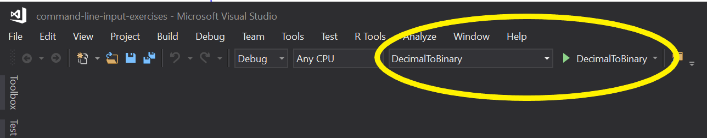

# Command Line Programs

The purpose of this exercise is to provide students with the opportunity to practice and reinforce the skills they have learned during lecture related to building command line applications. In this exercise, students will be responsible for creating command line applications that will:

   * Convert a temperature from one unit of measure to another.
   * Convert a length from one unit of measure to another.
   * Calculate and display the Fibonacci sequence for a given number.
   * Convert a series of numbers from decimal to binary.

## Learning Objectives

After completing this exercise, students will understand:

* How to create command line applications.
* How to prompt and accept user input in a command line application.
* How to write output to the console in a command line application.

## Evaluation Criteria & Functional Requirements

* The project must not have any build errors.
* Appropriate variable names and data types are being used.
* The input and output match what is stated in the following requirements.

### Temperature Convert

The Fahrenheit to Celsius conversion formula is:

    Tc = (Tf - 32) / 1.8

where 'Tc' is the temperature in Celsius, and 'Tf' is the temperature in Fahrenheit.

The Celsius to Fahrenheit conversion formula is:

    Tf = Tc * 1.8 + 32

Write a command line program which prompts a user to enter a temperature, and whether it's in degrees (C)elsius or (F)ahrenheit. Convert the temperature to the opposite degrees, and display the old and new temperatures to the console.

```
Please enter the temperature: 58
Is the temperature in (C)elsius, or (F)ahrenheit? F
58F is 14C.
```

### Linear Convert

Write a program that converts meters to feet and vice-versa.

The foot to meter conversion formula is:

    m = f * 0.3048

The meter to foot conversion formula is:

    f = m * 3.2808399

Write a command line program which prompts a user to enter a length, and whether the measurement is in (m)eters or (f)eet. Convert the length to the opposite measurement, and display the old and new measurements to the console.

```
Please enter the length: 58
Is the measurement in (m)eter, or (f)eet? f
58f is 17m.
```

### Fibonacci

The Fibonacci numbers are the integers in the following sequence:

    0, 1, 1, 2, 3, 5, 8, 13, 21, 34, 55, 89, 144, ...

By definition, the first two numbers in the Fibonacci sequence are 0 and 1, and each subsequent number is the sum of the previous two.

Write a command line program which prompts the user for an integer value and display the Fibonacci sequence leading up to that number.


```
Please enter the Fibonacci number: 25

0, 1, 1, 2, 3, 5, 8, 13, 21
```

### Decimal to Binary

Write a command line program which prompts the user for a series of decimal integer values separated by spaces. Each decimal integer is displayed along with its equivalent binary value.

```
Please enter in a series of decimal values (separated by spaces): 460 8218 1 31313 987654321

460 in binary is 111001100
8218 in binary is 10000000011010
1 in binary is 1
31313 in binary is 111101001010001
987654321 in binary is 111010110111100110100010110001
```

## Getting Started

* Open the command-line-input-exercises.sln solution in Visual Studio.
* For each exercise, navigate to the corresponding project, and provide the code necessary to implement the features specified above in the `Main` method.
* To verify that your application works as expected, select the project name from the dropdown in the menu bar that is displayed next to the execute button, and then click the button to run the program. Alternatively, you should be able to right-click the project name, then select `Debug -> Start new instance`, which displays the console for your application.



## Tips and Tricks

* To prevent the application from closing immediately after it displays the results, you might want to consider adding a `Console.Read()` statement before the end of the method. This keeps the window open until you press another key, which allows you to review what is displayed before the application ends.
* The formulas for conversion formulas have been provided above for each of the exercises.
* Many people have solved the Fibonacci sequence in many different ways. In fact, this may even come up during a technical interview. Rather than looking at the solutions that already exist, try making an effort at solving this problem on your own. If you do borrow a solution, take the time to understand what the code is actually doing.
* Take the time to review each of the tasks for the output that should be displayed, as well as the text that should be used for prompting the user for information. Try to get this to match the specification as closely as possible when working through the exercise.
