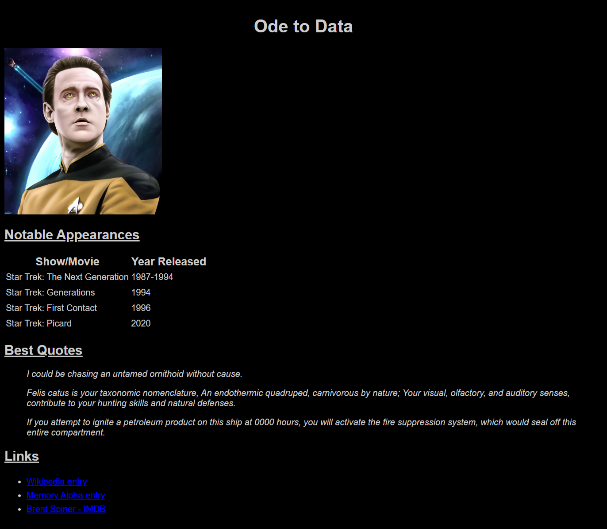

# Introduction to HTML and CSS Exercises

In this two-part exercise, you'll create:
1. A fan page for something that you like. The fan page can be for your favorite movie or TV show, your favorite sports team, or your favorite band.
2. An HTML form to submit some information about yourself.

For your fan page, you'll want to display a title, picture, and some different information. For your information form, you'll want to use the appropriate form elements for the data listed in the requirements.

Some other ideas for fan pages include:
- Your favorite book or book series
- Your favorite character from a book, movie, or TV show
- Your favorite actor
- Your favorite comic book character
- Your favorite video game or video game series
- Your favorite coding bootcamp program

See the requirements below.

## Requirements

These requirements apply to both parts of the exercise:

1. Use semantic HTML to organize content.
2. Include necessary tags for a valid HTML document.
3. Page must display using Live Server within Visual Studio Code.

### Fan page requirements

- Display the following content:
  - A main title in a large heading.
  - A related image.
    - Examples include a book cover, a movie poster, picture of a band, or picture of a team.
  - Information in a table.
    - Think of content that would benefit from a two or more column layout.
    - Examples include:
      - Characters from movie or TV show and the actors that play them.
      - Book or movie titles in a series and the year they were released.
      - Band members and the instruments they play.
  - 2-3 quotes using a semantic element.
    - Examples include your favorite song lyrics or your favorite TV character's quotes.
  - A list of 2-3 links.
    - Examples include IMDb pages, Wikipedia pages, or official band or team sites.
  - Section headings for table, quotes, and link sections.
- Style content using CSS:
  - Set a font for the page or certain elements.
  - Use a different background color for the page.
    - You may need to change the text color, too.
  - Make the quotes display in italics.
  - Center align the main title.
  - Set section headings to display underlined.
  - Change the font size for at least one element.
  - Try adding some other CSS properties like `line-height` and see how that changes content layout.

Tips:
- Use CSS to make the image smaller if you need to.
- Keep the list short, to about 3-4 items. If you pick something that causes you to have a long list, pick a few notable ones.
- Don't get too caught up in specifics. It's more important to see your code was done correctly than having accurate information.
- Refer to the [student book](https://book.techelevator.com/content/intro-html-css.html) for examples of HTML and CSS.

### Information form requirements

- At a minimum, ask for the following data (you may add more if you wish):
  - Name
  - Email address
  - Date of birth
  - Favorite color
  - Favorite number
  - Confirmation that the data is correct
- Make name and email address fields required.
- Create an HTML form with the necessary attributes.
  - Consider the information being sent and what might be the appropriate method.
  - You may use a fake URL for the destination of the form submission.
  - Consider this: what element is needed to submit the form?
- Use the appropriate form elements for the data.
  - Consider the necessary attributes for the form elements.
- Use labels for the form elements.
- Use CSS to:
  - Set a different background color on the form.
  - Add spacing between form inputs.

Tips:
- Refer to the [student book](https://book.techelevator.com/content/intro-html-css.html#forms) for information on HTML forms.

## Example fan page

Your fan page doesn't have to look exactly like this example, but hopefully it gives you some direction.

## Example information form

You may choose different text and colors as long as you satisfy the requirements.

