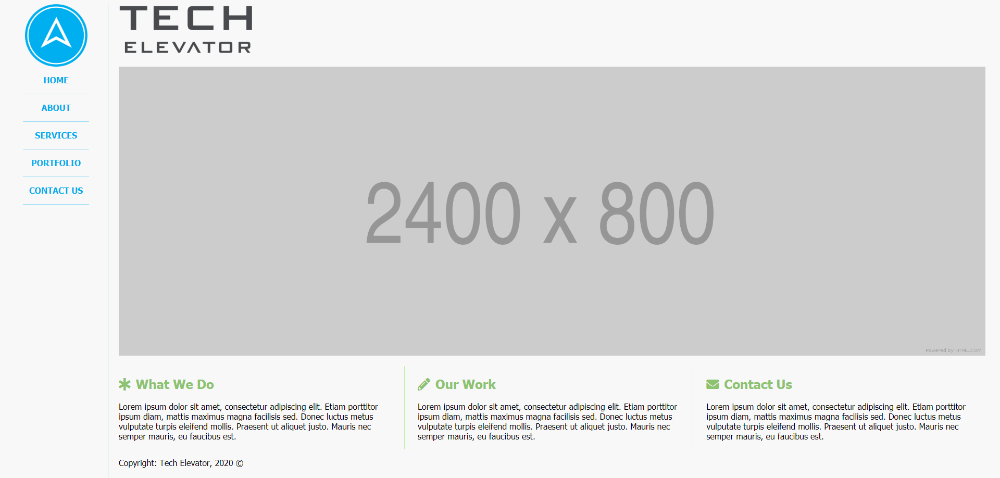
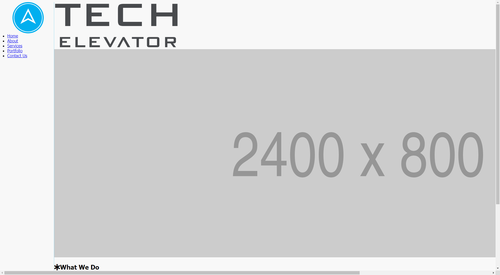
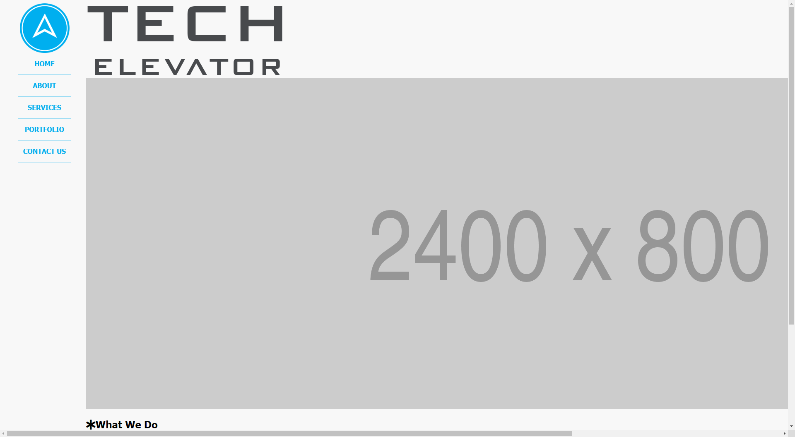
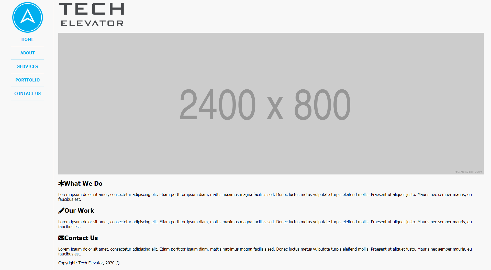
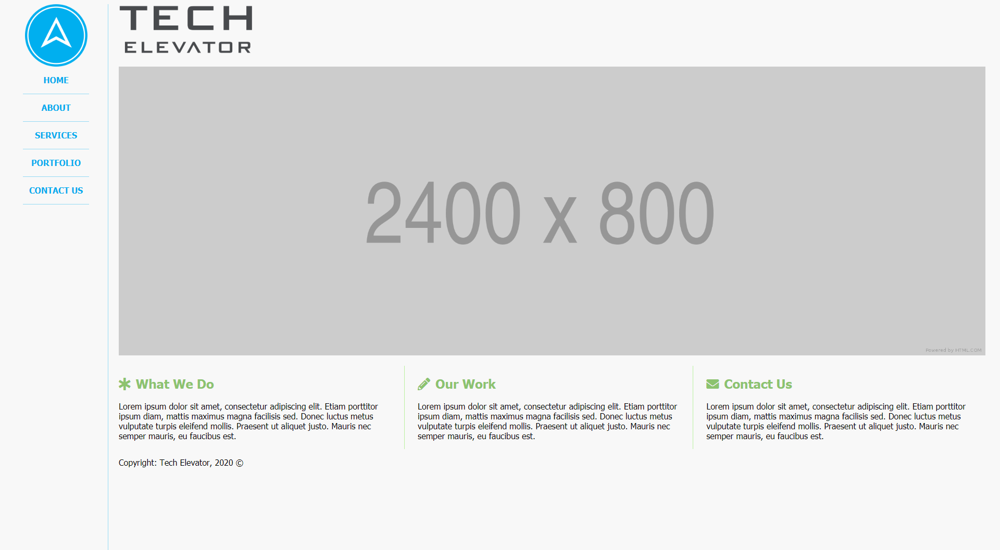

# CSS Selectors Exercise

In this exercise, you'll take the existing HTML in `index.html`, and use CSS to create a layout that reproduces what's shown in the below image. You'll create the CSS for the page in `style.css`. You shouldn't modify any of the existing HTML to complete this exercise.

## Before you begin 

Take a moment to explore the HTML file and its structure. Take note of the `<aside>`, `<nav>`, `<main>`, `<header>`, `<section>`, and `<footer>` blocks, and how the element tags relate to the content in them. Notice how without any styling, all the blocks "flow" from top to bottom in the same order in the rendered HTML.

Make sure to look at the existing CSS in `style.css` that was set up for you. Take note of the `*`, `html`, and `body` selectors and how the styles set a "default" value for properties like font size and background color.

Here are some design decisions to be aware of:

* The sidebar width is 200px.
* The top row (logo and heading) is 150px tall.
* Only the content on the right scrolls if the page is longer than the viewport.
* The colors used are:
    - Blue: #00ADEE
    - Blue Border: rgba(0, 173, 238, 0.4)
    - Green: #8CC36F
    - Green Border: rgba(170, 239, 135, 0.8)

## Step One: Style `aside`

In semantic HTML, element tags like `<aside>` and `<nav>` define the content that is contained in the tags. `<aside>` elements are meant for sidebars, and `<nav>` elements are meant for navigation. Since the `<aside>` comes first in the HTML, you'll style this first.

The `aside` needs to be set to a `fixed` position and have a 200px width. Add a right border to the `aside` that is 1px, solid, and uses the "Blue Border" color from above. Also, add a height of `100vh` so that the border goes all the way to the bottom of the viewport. Add left and right padding of 20px for spacing.

Next, set the `img` in the `aside` to have a 120px height and to be a `block` element. Then set `margin: 0 auto;`. This creates centered content. Be specific with the `img` selector so it doesn't affect the other images on the page.

Finally, set the `main` block to have a 200px left margin so it doesn't overlap with the `aside`.

After this step, your page looks like this:

## Step Two: Style `nav`

Create a CSS rule that selects the `li` elements in the `aside`. Set the `list-style` property to none, `text-align` to center, and `text-transform` to uppercase. Add a solid 1px bottom border using the same "Blue Border" color from above.

Next, set `margin` to `10px auto`. This is shorthand for setting the top and bottom margins to 10px and the left and right margins to auto. Auto helps to keep content centered.

Add a bottom padding of 10px so the links are vertically centered between the lines, and set a width of 80% so the border lines don't go from edge to edge.

Then, add a `line-height` of 2. This creates more spacing between the links and lines.

Finally, add a new rule that selects the `a` elements in the `li`s. Bold the text and set the color to the "Blue" color from above. Also, set the `text-decoration` to none. You can create another rule that selects the `:hover` pseudo-class of the `a` elements, and set the `text-decoration` property to underline so the links are underlined when you hover over them.

After this step, your page looks like this:

## Step Three: Style `header`

In semantic HTML, the `<main>` element contains the main content of a webpage. The `<header>` element might contain introductory content or navigation for that page. In this webpage, the `header` displays the logo and banner.

The header logo is a bit large. To change this, set the height for the `header` to be 120px and the `img` to be 80%. Be specific with the selector for the image so it only affects the header image.

Next, the 2400x800 banner image needs some styling so it doesn't go over the edge of the page. Make it a block element with 100% width. Be specific with the selector so it doesn't affect the `img` in the header section. 

>Hint: the banner image has a `class` attribute.

The `main` content block is against the border of the `aside`. Go back to the rule that you created for the `main` block in step one, and add a left and right padding of 20px each.

Now, your page looks like this:

## Step Four: Style `section`

The "What We Do", "Our Work", and "Contact Us" sections are still stacked on top of each other, but they need to be side by side. Create a CSS rule to select the `div`s in the `section` element. Make them display as inline-blocks with a width of 33%. Give each one a right padding and top margin of 20px each so there's some space in between.

Then, create a rule that selects the `h2` in the `section` element, and set the color to the "Green" color above. Create another rule that selects the `i` element in `h2`, and set a right margin of 10px.

Next, you need to create two more rules: one that creates the green border between the sections, and one that adds left padding. Create a rule that selects the first two `div`s by their IDs. Add a right border using the "Green Border" color from above that is solid and 1px. Create another rule that selects the second two `div`s by their IDs, and add a left padding of 20px.

> For "extra credit", the last two CSS rules can be done with the `:not` and `:first-child`/`:last-child` pseudo-classes. If you want to attempt the extra credit, look up how to use them and then replace the selectors with these pseudo-classes. 

Your page should now look like the screenshot from the beginning of the exercise:

