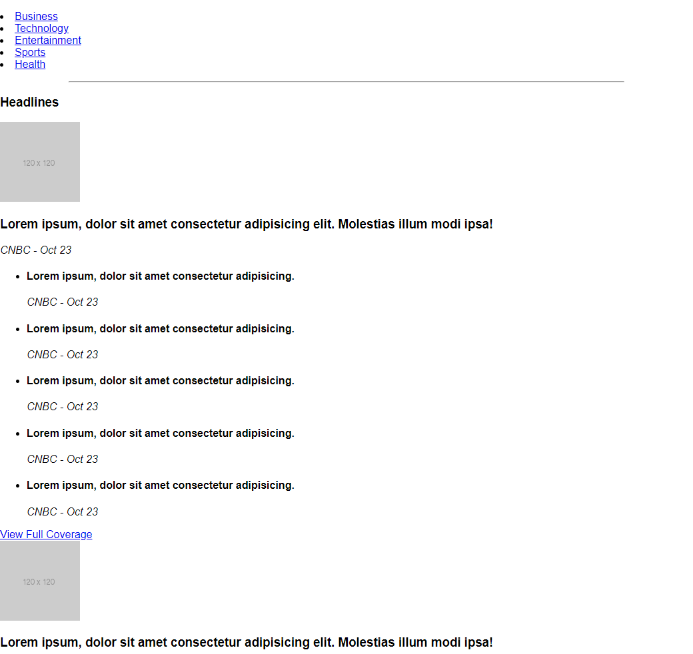
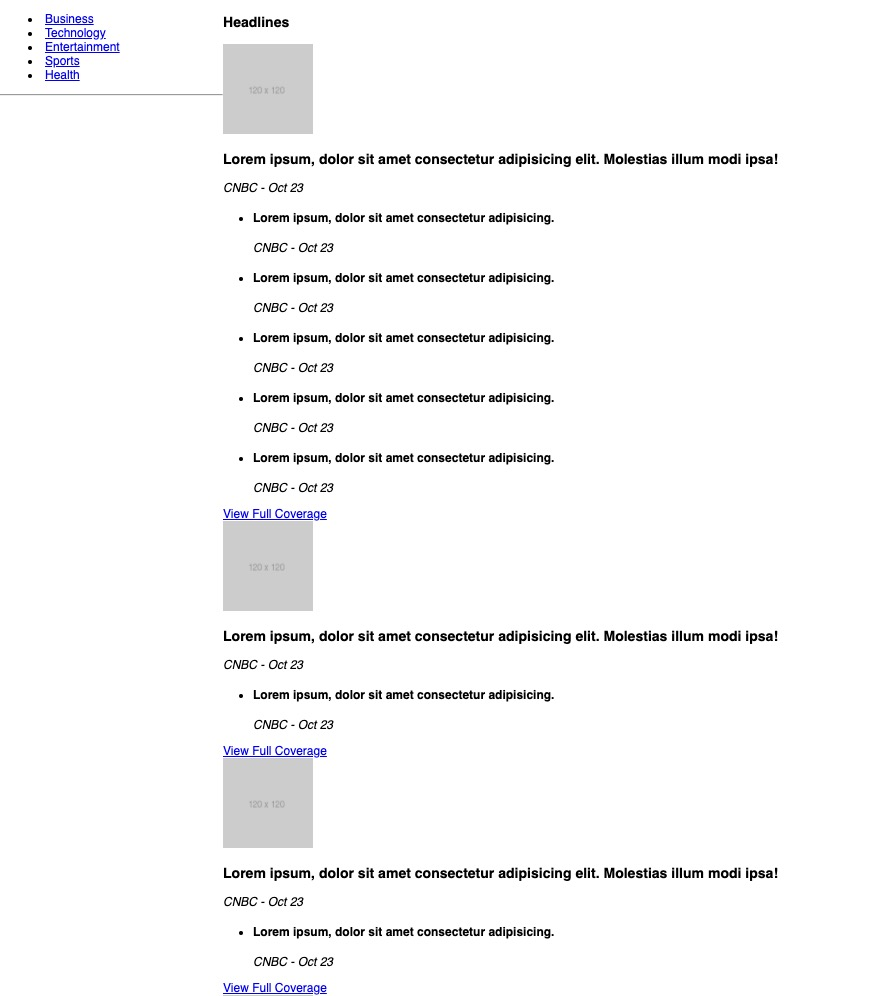
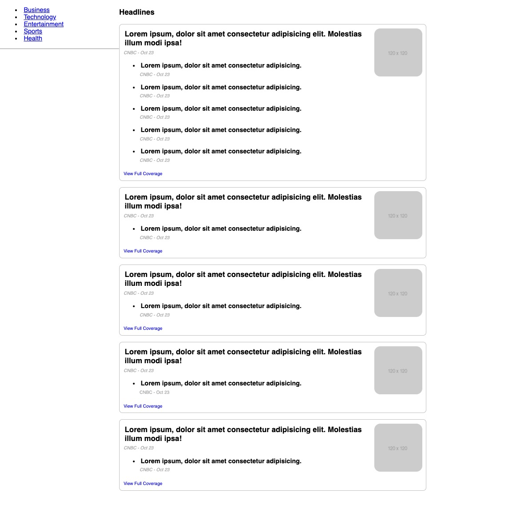
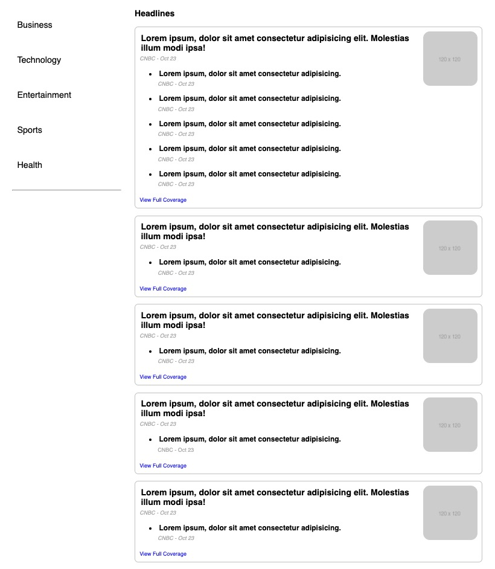

# CSS Selectors Tutorial Final

In this tutorial, you'll build a news application that displays a list of headlines with related articles.

## Starting Code

The starting code contains all the HTML for the new application in `index.html`. The stylesheet includes several styles to get you started. You need to fill in the rest.

If you run `index.html` using Live Server in VS Code, you'll see this:



In this tutorial, you'll fill the CSS in the `styles.css` file to create the following layout:


## Step One: Modify page layout

### 1. Position left panel

First, you'll need to position the menu on the left and the main content. You'll need to set properties on the `<section>` that contains the menu and then on the `<main>` element that contains the content. The menu is to be placed right up against the left side and very top of the display and to be `300px` wide.

There are two CSS selectors involved with this change. The first CSS selector for the `<section>` points to the section with the `id` attribute of `left-panel`. It looks like this:

```css
#left-panel
```

To position the menu, you'll need to set the `position` and `left` and `top` properties.

Add this code to the CSS file:

```css
#left-panel {
  position: absolute;
  left: 0;
  top: 0;
  width: 300px;
}
```

### 2. Position main content

The CSS selector for the `<main>` element points to the main element that is a direct descendant of the `<body>` element. It looks like this:

```css
body > main
```

To position the main content, you'll need to set the `position` and `left` properties.

Add this code to the CSS file:
```css
body > main {
  position: absolute;
  left: 300px;
}
```

> Why use a descendant selector here? There may be multiple elements of the same type within an HTML document. Using a descendant selector ensures that your styles are applied to the specific element you want to style.

At this point, your solution looks like this:



## Step Two: Format the articles

To format the articles, you'll need to:

- Style the article elements
- Position the article image
- Format the list of related news items
- Format the citation
- Format the links

### 1. Style the articles

The article requires a `1px`, `solid` border with a radius of `8px` using the `border-color` of `silver`. When you define a border, you'll notice that the text has no spacing. You can add spacing to the *inside* of the `<article>` using `padding` that's set to `10px`.

Next, add spacing between the articles since they're too close.  You'll add spacing to the *outside* top and bottom of the article. To do so, add a `margin` of `15px` for the top and bottom margins and `0` for the left and right margins. The articles are descendants of the `<main>` element, so use the descendant selector, as shown below:

```css
body > main > article {
  border: 1px solid silver;
  border-radius: 8px;
  padding: 10px;
  margin: 15px 0;
}
```
> Try adding the above stylings one at a time to see how each one impacts the page. After each change, save the `styles.css` file, and view the page in your browser. You may need to refresh the page.

### 2. Position the article image

The image placement in the final solution requires the image to be on the right side of the block containing the article. You can use the `float` property and assign the value of `right`. Add this CSS to the file:

>Note the use of the descendant selector below.

```css
main > article > img {
  float: right;
  border-radius: 15px;
}
```

### 3. Format related new articles list

The list of related news articles is ready for styling. The solution shows that you need to bring the headings and citations closer together.

You'll reduce the margin surrounding the article and related article titles. These are contained in `<h3>` and `<h4>` elements, which have default margins. Set the `margin` to `3px` by adding this CSS:

```css
body > main > article h3,
body > main > article h4 {
  margin: 3px;
}
```

Next, you'll need to set `margin-bottom` to `15px` for the `<li>`s to create some space between the list items. Add the following CSS:

```css
body > main > article > ul > li {
  margin-bottom: 15px;
}
```

### 4. Format the citation

Next, change the `font-size` and font `color` to match the requirements. The citations are in `<span>` elements that have a `class` attribute with the class name of `citation`. Select the `<span>` in the `<article>` with that class name. Add this CSS:

```css
body > main > article span.citation {
  font-size: .7em;
  color: darkgray;
}
```

### 5. Format the "View Full Coverage" links

The next step is to format the "View Full Coverage" link (`<a>` tag) to remove the underline and reduce the `font-size`. In this case, the `<a>` tags have an attribute of `target` with a value of `_blank`—this attribute and value makes links open in a new window or tab. Use an attribute selector to select all the `<a>`s with that attribute and value to apply these CSS values. Add this CSS:

```css
a[target=_blank] {
  text-decoration: none;
  font-size: .7em;
}
```

Lastly, add a `:hover` *pseudo-class* to the `<a>`s using the same selector. The intent is to underline the link text when the mouse rolls over the link:

```css
a[target=_blank]:hover {
  text-decoration: underline;
}
```

When you've completed all of the items related to the article, your HTML page looks like this:



## Step Three: Format the left menu

The menu is contained in the `<section>` element that is right under the `<body>` tag. The structure looks like this:

```html
  <section id="left-panel">
    <nav>
      <menu>
        <li>
          <a href="#">Business</a>
        </li>
        <li>
          <a href="#">Technology</a>
        </li>
        <li>
          <a href="#">Entertainment</a>
        </li>
        <li>
          <a href="#">Sports</a>
        </li>
        <li>
          <a href="#">Health</a>
        </li>
      </menu>
    </nav>
    <hr>
  </section>
```

### 1. Format the menu list items

Your first tasks for formatting the menu are to:

- Remove the "dots" in front of the list items
- Create some spacing around the menu items

You already used the `id` selector for the `<section>` containing the menu. Now, you'll work with the `<li>`. Set the `list-style` to `none`, and `padding` to `13px 0`. Add this CSS:

```css
#left-panel > nav > menu > li {
  list-style: none;
  padding: 13px 0;
}
```

### 2. Format the links

Next, you need to format each of the links:

- Remove the underline from the `<a>`s
- Change the `font-size` and font `color`
- Change the `<a>` from an *inline* element to an *block* level element
- Set the width to `70%` and center the `<a>` within the menu

First, add a CSS selector that selects the `<a>` tags that exist within the `<menu>`'s `<li>`s. Add styles to the selector that provide each of the effects in the list of styles needed to accomplish the goal:

```css
#left-panel > nav > menu > li > a {

}
```

You can remove the underline from the anchor tags by setting the `text-decoration` to `none`:

```css
#left-panel > nav > menu > li > a {
  text-decoration: none;
}
```

Next, change the font size and color:

```css
#left-panel > nav > menu > li > a {
  text-decoration: none;
  font-size: 1.2rem;
  color: black;
}
```

Set the width to `70%` and center the `<a>` within the menu using `margin`:

```css
#left-panel > nav > menu > li > a {
  text-decoration: none;
  font-size: 1.2rem;
  color: black;
  width: 70%;
  margin: 15px auto;
}
```

>Using a margin of `15px auto` is one method of "centering" content within a block-level element. So, this centers the `<a>`s in the `left-panel`. This only works on block-level elements, so this is set to `block`.

This is the final CSS to add for this step:

```css
#left-panel > nav > menu > li > a {
  text-decoration: none;
  font-size: 1.2rem;
  color: black;
  width: 70%;
  margin: 15px auto;
  display: block;
}
```



## Step Four: Add menu highlight and rollover effect

Now that your left menu is styled, you'll add some other features to it.

### 1. Add menu highlight

If you look at the markup for this tutorial, you'll notice that the Business list item has a class of `active-left-menu`:

```html
<li class="active-left-menu">
  <a href="#">Business</a>
</li>
```

Create the CSS rules for the `active-left-menu` to add the blue background and curved border:

```css
.active-left-menu {

}
```

You'll set the `background-color` using the CSS function `rgba()`. This function is similar to using a hexadecimal code—like `#87CEFA`—but instead uses integers between 0 and 255 for the values of Red, Green, and Blue. The fourth parameter for the function is for the "Alpha Channel", which is a graphics term for opacity or transparency. This value is a decimal number between 0 and 1, where 0 is fully transparent and 1 is fully opaque. With some transparency, you can let some of the color behind the element come through for a different effect than if the color was solid.

You'll see this, hexadecimal codes, and another function called `rgb()`, which doesn't accept a transparency value, throughout your career.

Pass these four arguments to the function to give you a light blue color with half transparency:

```css
.active-left-menu {
  background-color: rgba(135, 206, 250, 0.5);
}
```

To create the curved border, use the `border-radius` property. It takes a separate measure of a radius to apply to each corner starting from the top left corner and then moving clockwise. Since the border is only curved on the top right and bottom right, you need to set values for those and zeros for the others:

```css
.active-left-menu {
  background-color: rgba(135, 206, 250, 0.5);
  border-radius: 0 30px 30px 0;
}
```

Next, update the font `color` to `blue` for the active menu item:

```css
#left-panel > nav > menu > li.active-left-menu > a {
  color: blue;
}
```

>Why is this selector different? You must use the same *specificity* with the selector used so far, or the more specific styles override them. The original font `color` for these `<a>` tags was set using the same selector you see here. To see what happens otherwise, change the selector to `.active-left-menu > a`. You'll see that the font `color` remains black.

### 2. Add menu rollover effect

You'll want to provide some feedback when an available menu item can be clicked on. To do this, you'll use the `:hover` pseudo-class.

Apply the `:hover` pseudo-class to the `<li>`s within the menu that apply the `background-color` of `rgba(208, 235, 252, 0.5);`. The border must match the active menu items' border and its `border-radius` property. The font `color` must be set to `blue`. Add this CSS:

```css
#left-panel > nav > menu > li:hover {
  background-color: rgba(208, 235, 252, 0.5);
  border-radius: 0 30px 30px 0;
  color: blue;
}
```
With these styles applied, you'll see a light blue background with a curved border appear for each menu element in the left panel as you roll your mouse over the item.

If you have done everything correctly, your page looks like this:


## Summary

You've accomplished a lot here. You created a two-panel layout by arranging a menu of items on the left and main content on the right. You used several different types of CSS selectors and many CSS styles to accomplish this goal. The website looks much better and now provides feedback with hover effects.
