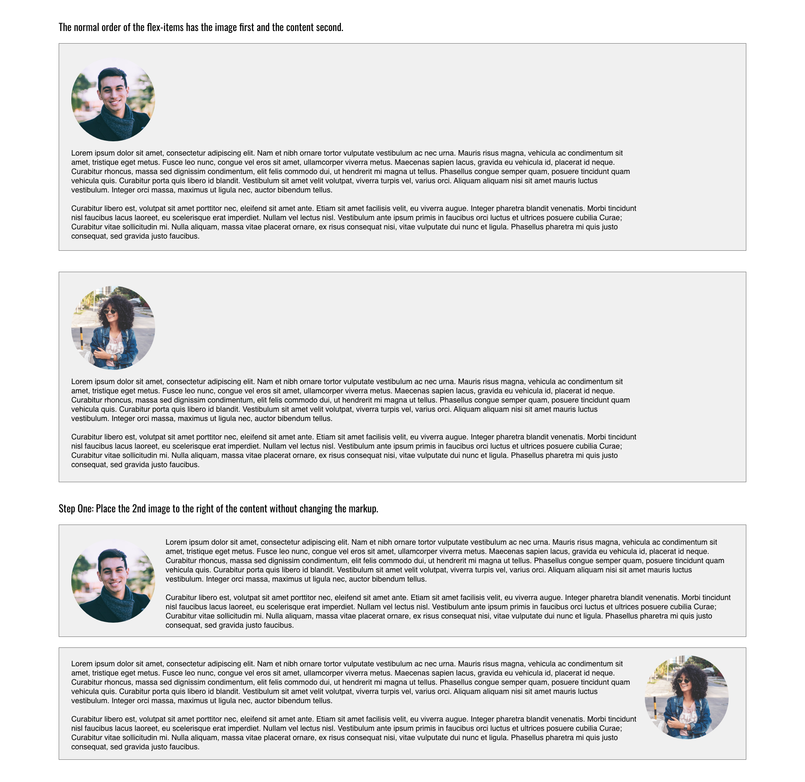

# Set One: Practice with flexbox properties

This is a collection of exercises that test your knowledge of flex container and flex item properties. Each set of exercises have their own folder, like `./header/`, and for each step in a set, there's a new folder.

## Before you begin

To run the files for each exercise, open the Terminal/Command Prompt and run `live-server`. If you run `live-server` from the folder this README is in, the server lets you navigate to the sub-folders each mini-exercise is located in.

## Step One: Adjust header layout

In the header exercises, you'll align several navigation items.

- `header/step-1`: Display all navigation items and logo in a row.
- `header/step-2`: Step one changes, and center align the navigation items.
- `header/step-3`: Step one changes, and right align the navigation items.
- `header/step-4`: Step one changes, and right align the user icon by setting `.spacer` to take up the rest of the available space.

## Step Two: Align flex items within a row

In this exercise, you'll align several flex items within a row.

- `align-content-row/step-1`: Align the content on the row so each box has the same space around them.
- `align-content-row/step-2`: Align the content on the row so each box has the same space between them.

## Step Three: Align flex items in a column

In this exercise, you'll align several flex items within a column.

- `align-content-column/step-1`: Align the content in the center of the column.
- `align-content-column/step-2`: Align the content at the end of the column.
- `align-content-column/step-3`: Align the content at the start of the column.
- `align-content-column/step-4`: Align the content in the center of the column, and distribute each item with the same amount of space around them.

## Step Four: Size flex items 

In this exercise, you'll size several flex items with `flex-grow`, `flex-basis`, and `flex-shrink`.

- `flex-items-size/step-1`: Each of the flex items must grow to fit the container.
- `flex-items-size/step-2`: The second and fourth items must grow twice as much as the first and third items. The first and third items must grow to fit the container.

## Step Five: Wrap flex items

In this exercise, you'll wrap flex items when their width exceeds that of their container.

- `flex-wrap/step-1`: The flex-items must wrap to the next line if their total width is greater than the container.

## Step Six: Order flex items

In this exercise, you'll order elements on a page without changing the HTML markup.

- `flex-order/step-1`: Place the second image to the right of the content without changing the markup.
