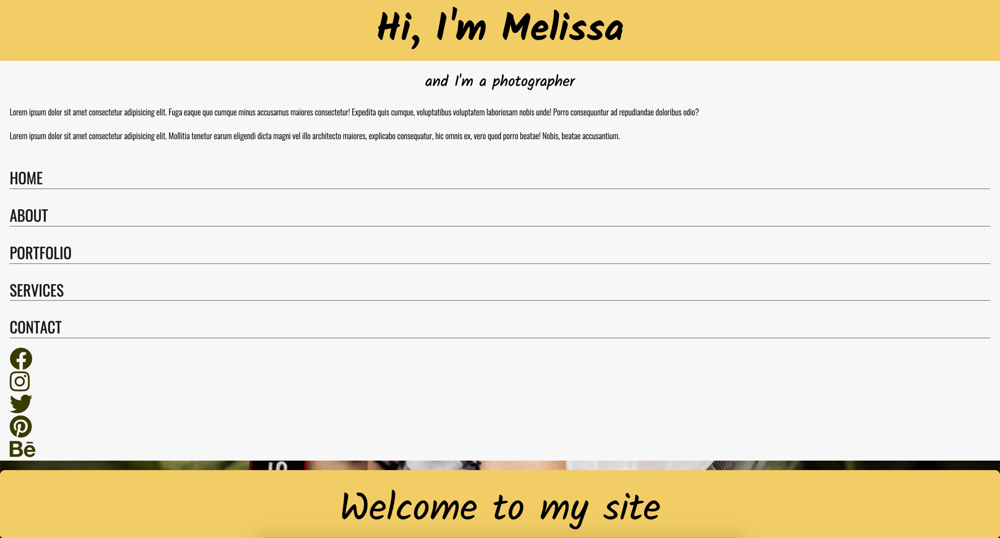
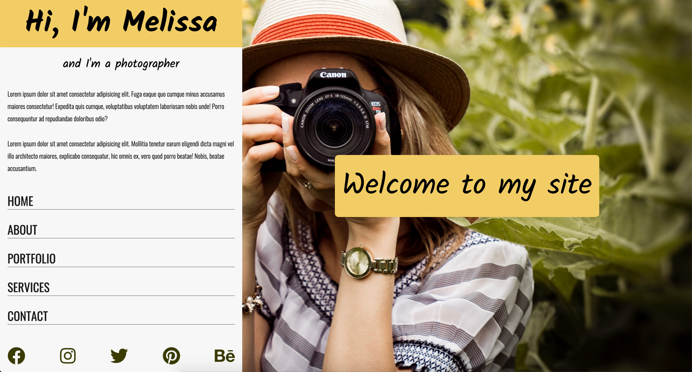

# Set Two: Build a portfolio page with flexbox

This exercise gives you the chance to test your Flexbox knowledge by building a photography portfolio.

## Before you begin

Run the project by right-clicking on `index.html` in Visual Studio Code and selecting `Open with Live Server`. When you first run the project, it looks like this:



If you complete all of the steps in this exercise, your solution looks like this:



Make all of your changes for this exercise in `css/main.css`. You don't need to change the HTML markup to complete this exercise.

## Step One: Define the overall layout

The layout for this page consists of two panels: a left panel and a right panel. The left panel contains a bio, navigation, and social media links. The right panel displays an image and a welcome banner. The body style pushes the layout to full screen using `min-height: 100vh`, but it's missing something. You need to add one property to lay out the items in a row:

```css
body {
  margin: 0;
  padding: 0;
  min-height: 100vh;
  /* Photo by Andre Furtado on Unsplash */
  background: url(../img/andre-furtado-JtV6zyOZSrA-unsplash.jpg) left / cover
    no-repeat;
  /* add style here */
}
```

## Step Two: Add flex layout to the left panel

Add a flex layout to the left panel so the items stack on top of each other and take up a width (basis) of 35%:

```css
#left-panel {
  background-color: #f7f7f7;
  /* add styles here */
}
```

## Step Three: Add styles to social icons

Next, you need to add styles to the following class so that the social icons are in a row that stretch across the width of the left-panel and have the same amount of space between each of them:

```css
ul.social-icons {
  list-style-type: none;
  margin: 20px 20px;
  padding: 0;
  /* add styles here */
}
```

You also need to add a style to the nav so that it **grows** to take up the rest of the available space. This pushes the social media icons to the bottom of the left panel:

```css
nav {
  /* add style here */
}
```

## Step Four: Center welcome banner

Finally, you need to center the welcome banner in the middle of the right panel. There are four styles needed to achieve the desired effect:

```css
#right-panel {
  /* add styles here */
}
```

## Solution

If you completed all four steps, your solution looks like this:


