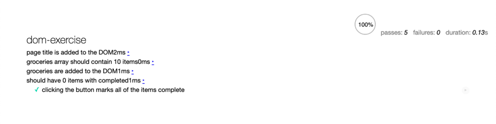

# DOM Exercise

In this exercise, you'll build a shopping list from data. You'll find all of the code you need to get started in the folder `shopping-list`.

## Exercise

The first thing you need to do is open up `js/shopping-list.js` and create two variables named `pageTitle` and `groceries`:

    * pageTitle: {string} This should be set to 'My Shopping List'
    * groceries: {Array} This should be an array of 10 items for your shopping list. The items in the array can be strings.

### Page Title

When the application loads, the `setPageTitle()` function is called. It is your job to fill in that function and make it work. You should take the contents of the `pageTitle` variable and update the DOM.

### Groceries

When the application loads, the `displayGroceries()` function is called. It is your job to fill in that function and make it work. You should take the array of groceries, create a new list item element, and append it to the unordered list on the page.

### Completed

When the application loads, there's an event listener attached to the button. Don't worry too much about how this works, as you'll learn more about that in a future lesson.

When you click the button, it calls the method `markCompleted()`. It is your job to make that method work. You should be able to get **all** of the list items on the page and add the class `.completed` to each one.

## Tests

To consider this exercise complete, your shopping list application should do the following:

* When the application loads, the `setPageTitle()` function is called
    * This should get a reference to target the id `title` and set it to 'My Shopping List'
* When the application loads, the `displayGroceries()` function is called
    * You should have a variable called groceries that contains 10 items
    * You should loop over this array and create a list item element for each and add it to the DOM
    * TIP: Make sure you target the unordered lists id and not the list itself—be specific
* When the application loads, there's an event listener attached to the button
    * When you click the button, it calls the method `markCompleted()`
    * You should get all of the list items and add the `.completed` class to them

If you look inside of the `tests` folder, you'll find a `tests.html`. You can run this by right-clicking on `tests.html` and opening it with live server to see if all of the tests pass.

