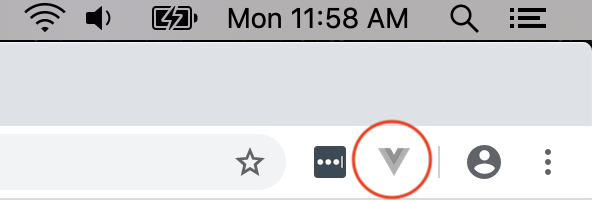
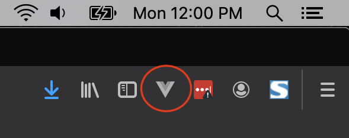
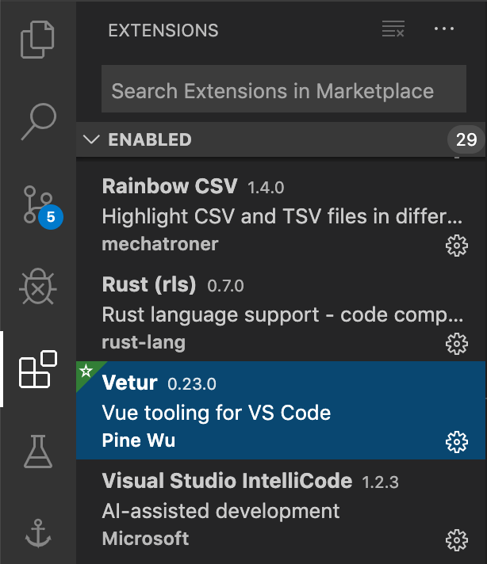
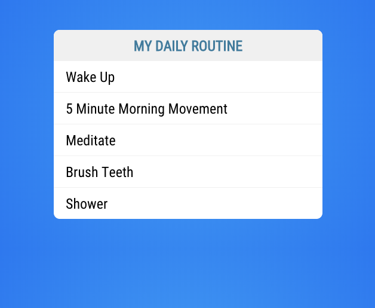
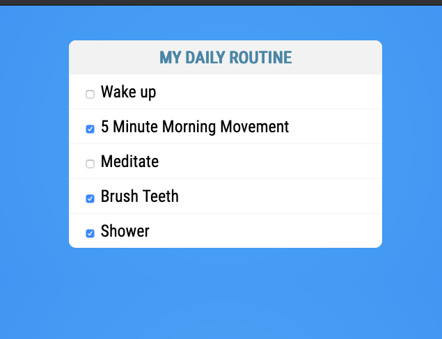
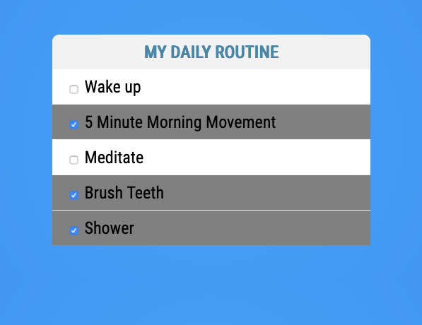
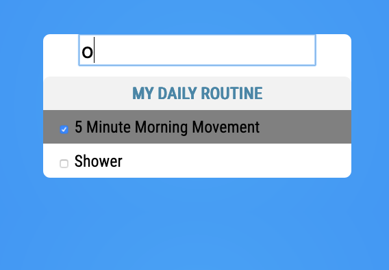

# Tutorial for Introduction to Vue.js

In the reading material, you were introduced to Vue. In this tutorial, you'll make sure you have all the tools you need to use Vue to build components. After that, you'll write your first Vue Component.

## Step One: Make sure the Vue CLI is installed

In the reading material, you learned how to install the Vue CLI. If you've already done this, you can skip this step and move on to step two. If you haven't installed the Vue CLI, go back to the student book and follow the steps to install it. You want to make sure the Vue CLI is installed and working before lecture.

The best way to confirm that the Vue CLI is installed is through the command line. Enter the following command:

```
$ vue --version
```

If the Vue CLI is installed, you'll see the Vue CLI version:

```
vue --version
@vue/cli 4.1.2
```

If you receive `command not found`, or anything other than the Vue CLI version, the Vue CLI isn't installed yet.

## Step Two: Install Vue DevTools

The Vue DevTools is a browser extension for Chrome and Firefox that is used to debug Vue.js applications. Follow the links below and install it for your browser of choice:

* [Get the Chrome Extension](https://chrome.google.com/webstore/detail/vuejs-devtools/nhdogjmejiglipccpnnnanhbledajbpd)
* [Get the Firefox Addon](https://addons.mozilla.org/en-US/firefox/addon/vue-js-devtools/)

You can confirm installation of the Vue DevTools by launching your chosen browser and looking for the Vue DevTools icon.





## Step Three: Make sure the Vetur Visual Studio Code extension is installed

The Vetur Visual Studio Code extension has several [features](https://vuejs.github.io/vetur/) for developing Vue applications, including:

* Syntax-highlighting
* Snippet
* Emmet
* Linting and Error Checking
* Formatting
* IntelliSense
* Debugging

The Vetur Visual Studio Code extension should already be installed, as it's part of Tech Elevator's student installation process. To make sure it's there, look for Vetur under your "Enabled" Visual Studio Code Extensions. If it's enabled, go to step four.



If the extension is not listed, go to the extensions marketplace in Visual Studio Code, search for Vetur, and install it.

## Step Four: Build your first component

Now, you'll build out a todo list component. Once you've built that component, you'll import it into your main application and display it on the screen. Then, you'll add functionality that exercises Vue's dynamic data binding features.

You'll start with a small project that's already been created for you. The project is located in this directory.

### 1. Run `npm install`

If you remember from the student book, this is an existing project that has some dependencies that aren't stored in source control. To install your project's dependencies, run the following command:

```bash
npm install
```

### 2. Build out your TodoList component

In your `components` folder, create a new file called `TodoList.vue`. A new component usually consists of three pieces:

* HTML: `<template></template>`
* JavaScript: `<script></script>`
* CSS: `<style></style>`

You can copy and paste the following code into your new component, or if you have the [Vetur Extension](https://github.com/vuejs/vetur) installed, you can type out `vue` and press `tab` to create this:

```html
<template>

</template>

<script>
export default {

}
</script>

<style>

</style>
```

First, start with building the markup for this component. You'll build out a todo list. You can copy and paste the following code inside of the `<template></template>` tag:

```html
<div class="todo-list">
    <h1>My Daily Routine</h1>
    <ul>
        <li>Wake Up</li>
        <li>5 Minute Morning Movement</li>
        <li>Meditate</li>
        <li>Brush Teeth</li>
        <li>Shower</li>
    </ul>
</div>
```

Next, paste the following CSS code between the `<style></style>` tag to give your list some style. Feel free to copy and paste this part instead of typing it all in:

```css
.todo-list {
    width:450px;
    background: #fff;
    margin: 50px auto;
    font-family: 'Roboto Condensed', sans-serif;
    border-radius: 10px;
}
h1 {
    background:#f2f2f2;
    color:#4b86A6;
    padding:10px;
    font-size:24px;
    text-transform: uppercase;
    text-align: center;
    margin-bottom: 0px;
    border-top-left-radius: 10px;
    border-top-right-radius: 10px;
}
ul {
    list-style-type: none;
    margin:0px;
    padding:0px;
}
li {
    font-size: 24px;
    border-bottom:1px solid #f2f2f2;
    padding:10px 20px;
}
li:last-child{
    border:0px;
}
```

At the moment, leave the `<script></script>` tags empty.

### 3. Open App.vue

Now that you've built your component, you need to display it on the screen. To use the component in your application, you need to import it first. Open `App.vue`, and at the beginning of your JavaScript section, add a new import line to import your new component:

```javascript
import TodoList from './components/TodoList';
```

Then add the component to the components section of the Vue object:

```javascript
components: {
  TodoList
}
```

Now that you've imported the component, you can use it in the HTML portion of the `App` component. The name of the component is `TodoList`. Follow the naming standard for components, which says that all custom-made HTML elements must be all lowercase and include a hyphen. This means that for this tutorial, the component is `<todo-list></todo-list>`:

```html
<template>
  <div id="todo-app">
    <todo-list></todo-list>
  </div>
</template>
```
If your component is a single word, like "Clock", you'll typically add an additional word such as "WebClock", and then apply the same naming rules as above, as in `<web-clock></web-clock>.`

### 4. Run your Todo application

If you run the application using `npm run serve` and visit http://localhost:8080, you'll see this:



## Step Five: Add data binding to your Todo application

Now that you've completed your basic Todo application, you can make it more dynamic by having the todo items in JavaScript data instead of hard-coded in the HTML of the component.

The first thing you need to do is open the `TodoList.vue` component and remove all of the hard-coded list items:

```html
<template>
    <div class="todo-list">
        <h1>My Daily Routine</h1>
        <ul>
            <li>Wake Up</li>
            <li>5 Minute Morning Movement</li>
            <li>Meditate</li>
            <li>Brush Teeth</li>
            <li>Shower</li>
        </ul>
    </div>
</template>
```

Now that you understand what data binding is, you'll create an array of todo items and use `v-for` to display them in your list.

First, create an empty array inside the return of the data function:

```javascript
<script>
export default {
  data() {
    return {
      todos: []
    }
  }
}
</script>
```

Now, you can take the list items that you used before and add them to the todo array:

```javascript
<script>
export default {
  data() {
    return {
      todos: [
        {
          name: 'Wake up'
        },
        {
          name: '5 Minute Morning Movement'
        },
        {
          name: 'Meditate'
        },
        {
          name: 'Brush Teeth'
        },
        {
          name: 'Shower'
        }
      ]
    }
  }
}
</script>
```

Now that you have an array of todo items, it's time to display them in the list. To do this, use the `v-for` directive. Place the following code inside of the `<ul></ul>` tags in your template:

```html
<h1>My Daily Routine</h1>
<ul>
  <li v-for="todo in todos" v-bind:key="todo.name">{{ todo.name }}</li>
</ul>
```

You can now run the application using `npm run serve`. Visit http://localhost:8080 to see the same list you had before:


The difference now is that you aren't hard-coding the values in the markup. You created a todo array, and then, thanks to data binding, you were able to dynamically iterate over that array and display them in your list.

## Step Six: Add dynamic data with two-way data binding

Now, add checkboxes to each of the todo items so that todo items can be marked as completed. To do this, add a new data property to each of the todo items in the `data()` section of the component. Call it `done` and default it to `false`:

``` JavaScript
data() {
  return {
    todos: [
      {
        name: 'Wake up',
        done: false
      },
      {
        name: '5 Minute Morning Movement',
        done: false
      },
      {
        name: 'Meditate',
        done: false
      },
      {
        name: 'Brush Teeth',
        done: false
      },
      {
        name: 'Shower',
        done: false
      }
    ]
  }
}
```

Now, connect that to a checkbox next to each item. Create the checkbox in the `<li>` element and use `v-model` to connect it to the `done` property:

``` HTML
<li v-for="todo in todos" v-bind:key="todo.name">
  <input type="checkbox" v-model="todo.done" />
  {{ todo.name }}
</li>
```

If you run your project, you'll see that you can now check and uncheck the box next to the todo item.



## Step Seven: Data bind CSS classes on elements

Now, add in a new binding that sets a grey background color on the todo item when it's marked as `done`. You do this by binding the `done` property to toggle a class on the `<li>`.

First, create the class:

``` CSS
.finished {
  background-color: grey;
}
```

Then, in the `<li>` defined earlier, add the following `v-bind:class` to set the `finished` class to be added when `done` is true and removed when `done` is false:

``` HTML
<li v-for="todo in todos" v-bind:key="todo.name"
    v-bind:class="{ finished: todo.done }">
  <input type="checkbox" v-model="todo.done" />
  {{ todo.name }}
</li>
```

Remember that `v-bind` takes a JavaScript object where the names are the CSS classes to add, and the values are booleans that signify if the classes should be added or not. In the above example, `finished` is the class to be added, and `todo.done` is the boolean data property that says whether it should be added (`true`) or not (`false`).

Clicking on the checkboxes now greys out the item in the list, and unchecking a box returns it to normal.



## Step Eight: Filter the Todo items

The last feature you'll add is the ability to filter the todo items so that you only show the items that match a user's search criteria. There are many steps to get this working, so work through each one in order.

First, capture the user's input by adding a new data property to the component called `filterText`:

``` JavaScript
data() {
    return {
      filterText: '',
      todos: [
        ...
```

Then bind that to an input field above the todo list:

``` HTML
<input type="text" v-model="filterText" />
<h1>My Daily Routine</h1>
```
Next, add CSS to lay out the input field:

``` CSS
input[type=text] {
  width: 75%;
  margin: auto;
  font-size: 2em;
  display:block;
}
```

Now, anything typed into the text field is put into the `filterText` data property.

To create a filtered list of items, you need to decide where the new list should live. The original list of items can't be changed because you don't want to lose items on the list—just temporarily filter them. If the filter text is empty, all items must be shown. If the filter text is set, use it to find the todos that contain that text.

This is best done with a `computed` property. The data property always contains all the todo items, and a computed property returns only a subset of that data property that matches the `filterText`.

Create the computed section of your component under the `data(){...}` section:

``` JavaScript
computed: {

}
```

Then write a method that returns an array of todos that contains the filter text. To access the component itself, use the `this` variable:

``` JavaScript
computed: {
  filteredTodos() {
    return this.todos.filter((todo) => {
      return todo.name.includes(this.filterText);
    });
  }
}
```

You can then use this new `filteredTodos` property rather than the `todos` property in your `v-for` loop:

``` HTML
<li v-for="todo in filteredTodos" v-bind:key="todo.name"
    v-bind:class="{ finished: todo.done }">
```

Now, you see a real-time, updated list of todos based on the text typed into the filter.



## Summary

In this tutorial, you:

- Learned how to create new component using HTML, JavaScript, and CSS
- Added a new component to a Vue project
- Used data binding to connect a component's UI and properties
- Used `v-for` to create a list in HTML from a JavaScript array
- Added a checkbox connected to a data property for dynamic updates
- Used `v-bind` to bind a data property to class attributes
- Used a computed property to dynamically modify data display