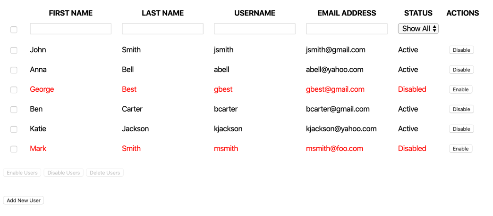
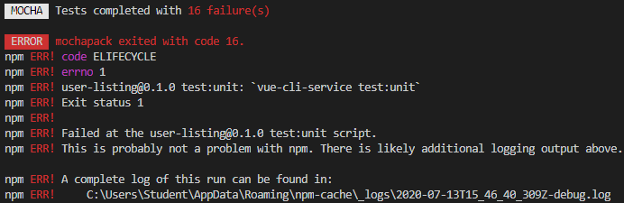
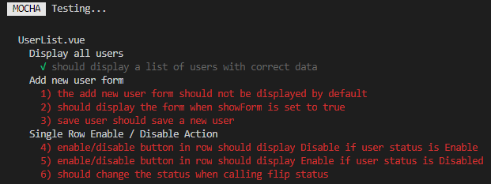
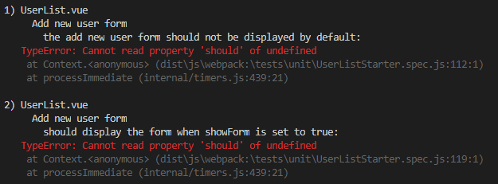
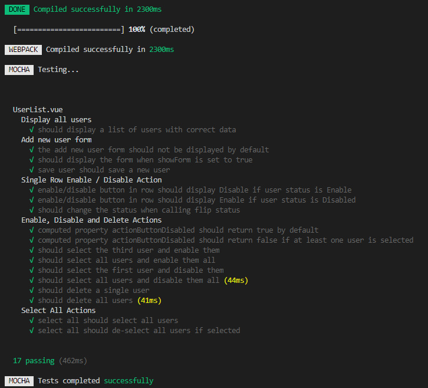

# Vue.js Event Handling Exercise

In this exercise, you'll build on the previous exercise that asked you to display a list of users in a table. First, you'll start by creating a new user form so that new users can be added to the list. Second, you'll add the ability to select one or more users and then perform actions on them such as enable, disable, and delete. This is what the final application should look like:

## Step One: Initialize the project

After opening the project folder in Visual Studio Code, open the `Terminal` menu and click on `New Terminal`. Alternatively, you may press `` Ctrl+` `` on Windows and macOS. Next, run the command `npm install` to install any dependencies before working on the project.

## Step Two: Run unit tests

There are unit tests located in `/tests/unit/UserList.spec.js` that you can run as you complete each task. To run the automated tests, run the command `npm run test:unit` from the `Terminal`. There are **17** unit tests. The first test, "should display a list of users with correct data", passes. All others fail before you begin writing any code.

As you complete a feature, run the unit tests, and make sure the tests associated with that feature pass before moving on.

Make sure you follow the requirements and name your properties, methods, and computed properties exactly as they're shown. The tests rely on these names. If you have tests failing and aren't sure why, this could be the reason.

### Test failures

If there are any failing tests, you'll see the number of failures in the terminal window. Depending on your terminal window size, you may have to scroll up to see the number of failing tests as there are other unassociated error messages that appear after the number. You don't need to worry about the other error messages, unless you don't see the number of test failures:

If you want to see which tests are failing and why, you'll have to scroll up further. Near the top is the list of the passing and failing tests:

Below that list are the details of why each test failed. The numbers in the list above correspond to the numbers in the list below:

## Step Three: Add a new user form

The markup for the new user form is already in the template. Complete the following tasks:

- The form should be hidden by default.
  - Use a property called `showForm`.
  - Toggle `showForm` with `v-on`.
  - Use `v-show` to show/hide form appropriately.
- Each form field should be bound to the correct property in the `newUser` object.
- Create a `saveUser` method that adds a new user to the `users` array when the form is submitted.
  - Clear the form after the user is saved.

> Once you complete this step, the three tests under "Add new user form" pass.

## Step Four: Add an enable/disable button in action column

In the "Action" column of the table, there's a button that enables or disables the user. Complete the following tasks:

- If the user status = 'Active', the button text displays 'Disable.'
- If the user status = 'Disabled', the button text displays 'Enable.'
- When you click the button, it calls a method `flipStatus()` and change the user's status from 'Active' to 'Disabled', or 'Disabled' to 'Active.'
  - The `flipStatus(id)` method takes the user ID as an argument.
  - You can use the user ID to find the user in the users array and change their status.

> Once you complete this step, the three tests under "Single Row Enable / Disable Action" pass.

## Step Five: Enable, disable, and delete selected users

There are three buttons below the user listing table. Complete the following tasks associated with those buttons:

- Add a `selectedUserIDs` property that defaults to an empty array.
- When the `selectedUserIDs` array is empty, the buttons should be disabled.
  - Note: use a computed property named `actionButtonDisabled` for this.
- When the checkbox for a row is checked, add the user's ID to the `selectedUserIDs` array.
  - Bind the checked value to if the user's ID is in the `selectedUserIDs` array.
- Enable Users
  - Sets the status of each selected user to `Active`.
  - Clears all checkboxes when action is completed.
  - Method name: `enableSelectedUsers()`
- Disable Users
  - Sets the status of each selected user to `Disabled`.
  - Clears all checkboxes when action is completed.
  - Method name: `disableSelectedUsers()`
- Delete Users
  - Deletes the user from the `users` array.
  - Clears all checkboxes when action is completed.
  - Method name: `deleteSelectedUsers()`

> Tip: Depending how you retrieve the user ID, Vue may give it to you as a string even though it's a number. This may give you issues with comparison—try converting to a number before adding to `selectedUserIDs` if you have comparison issues.

> Once you complete this step, the eight tests under "Enable, Disable and Delete Actions" pass.

## Step Six: Select all checkbox

The "select all" checkbox is the checkbox on the first row with the filter inputs. Complete the following tasks for the "select all" checkbox:

- When clicked to "checked" state, all boxes are checked and all users added to `selectedUserIDs`. When clicked again to "unchecked" state, all boxes are unchecked and all users removed from `selectedUserIDs`.
- If some of the boxes are checked, clicking "select all" selects all users. If clicked again, then it deselects all users.
- When all individual checkboxes get checked, then "Select all" is checked too.
- Add/remove the user IDs to/from the array depending upon the checked status of all checkboxes.

At this point, all 17 tests pass, as shown below:

