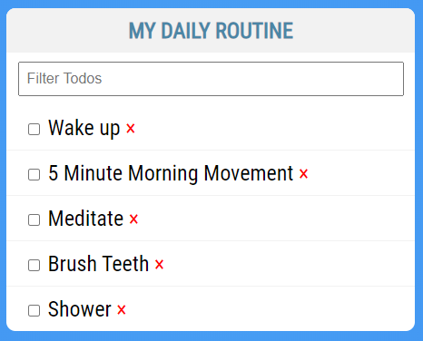
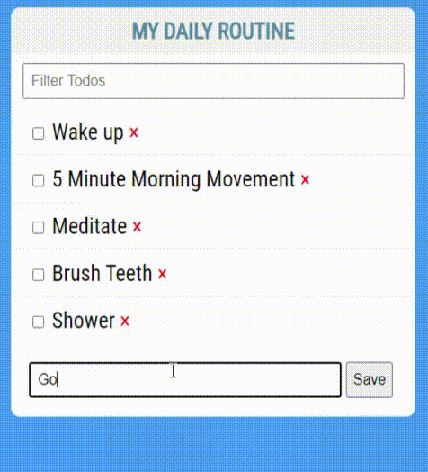

# Vue.js Event Handling Tutorial

In this tutorial, you'll work on event handling in Vue.js. You'll take the Todo List you built out and add some interactivity to it.

## Event handling

You've already added the ability to check and uncheck a todo item and filter the list of todo items using data binding. Simple functionality like this doesn't need event handling, but something more complex might. What about deleting a todo item or adding a new one?

These tasks require changing the array of items by removing an item or adding a new item.  Data binding alone isn't enough, so today, you'll add both of these functions to the todo list.

### Getting started

After opening the project folder in Visual Studio Code, open the `Terminal` menu and click on `New Terminal`. Alternatively, you may press `` Ctrl+` `` on Windows and macOS. Next, run the command `npm install` to install any dependencies before working on the project. After the dependencies are installed, run the command `npm run serve` to start the development server.

### Step One: Remove an item

First, open `src/components/TodoList.vue` and add a control to each todo item that looks like `<span class="delete">×</span>`:

``` HTML
<li
    v-for="todo in filteredTodos"
    v-bind:key="todo.name"
    v-bind:class="{ finished: todo.done }"
>
    <input type="checkbox" v-model="todo.done" />
    {{ todo.name }} <span class="delete">×</span>
</li>
```

This is the control used to delete an item. A click on the `×` triggers a handler to remove the item.

Now create the handler. The event handler lives in the `methods` section of the component. It's a JavaScript function that's called when a certain action happens in the browser—in this case, a click on the `span` element you created.

For the delete, create a new method called `deleteTodo` that takes the todo as an argument and then filters that todo out of the `this.todos` list:

``` JavaScript
methods: {
    deleteTodo(todoToDelete) {
        this.todos = this.todos.filter((todo) => {
            return todo !== todoToDelete;
        });
    }
}
```

> Note: there are a few different ways to remove an element from an array. This is just one way using methods you're familiar with.

Then, use that method to handle click events on the `span` you created:

``` HTML
<span class="delete" v-on:click="deleteTodo(todo)">×</span>
```

This says that when a click occurs on this span, the `deleteTodo` method is called, passing in the current `todo` as its argument. This then runs the method, filtering that todo out of the list of todos.

Notice that it's isn't clear whether or not someone can click on the `x`. To create the presentation of the `x`, add some CSS:

``` CSS
.delete {
    color: red;
    cursor: pointer;
}
```

Now the `×` is red and shows the appropriate mouse pointer.



### Step Two: Add an item

Adding a new item requires a form and input box to take input from the user and then add that information to the `todos` list.

First, make a new form below the unordered list:

``` HTML
<form>
    <input type="text" v-model="newItem" placeholder="Add new Todo" />
    <button type="submit" class="btn save">Save</button>
</form>
```

Since the input box is bound to a data property called `newItem`, make that property in the `data()` function:

``` JavaScript
data() {
    return {
        filterText: '',
        newItem: '',
        ...
```

Now you need to handle when the form is submitted—that is, when the user clicks the Save button or hits enter in the input box after typing, the form is submitted.

First, create a new method called `createTodo` in the `methods` section. This method uses the standard JavaScript `push` method to add a new item to the `todos` array:

``` JavaScript
methods: {
    deleteTodo(todoToDelete) {
        this.todos = this.todos.filter((todo) => {
            return todo !== todoToDelete;
        });
    },
    createTodo() {
        this.todos.push({
            name: this.newItem,
            done: false
        });
    }
}
```

Then, connect that to a submit event on the form:

``` HTML
<form v-on:submit="createTodo">
    <input type="text" v-model="newItem" placeholder="Add new Todo" />
    <button type="submit" class="btn save">Save</button>
</form>
```

If you try this now, you'll notice that the item is added, but the page immediately refreshes and reloads the default items. Why is that?

It's because, by default, a browser always loads a new URL on any form submission. You need to prevent that default behavior if you don't want that to happen. To do this, add `.prevent` to your `v-on`:

``` HTML
<form v-on:submit.prevent="createTodo">
    <input type="text" v-model="newItem" placeholder="Add new Todo" />
    <button type="submit" class="btn save">Save</button>
</form>
```

Notice that while the item is added, the input box still has text in it. When you handle the form in Vue, remember to clean up the input boxes once your actions are complete.

To do that, add the following line to your method:

``` JavaScript
createTodo() {
    this.todos.push({
        name: this.newItem,
        done: false
    });
    this.newItem = '';
}
```

Due to two-way binding, you'll see the input box is also cleared.



## Summary

In this tutorial, you wrote code that:

- Handled events on a simple click
- Handled a form submission
- Made the data more dynamic in your component using methods
