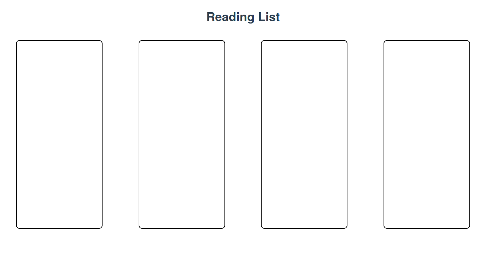
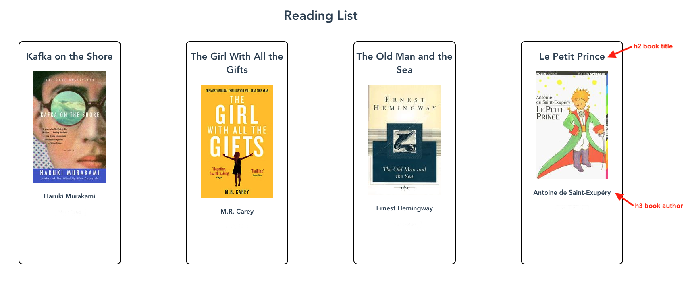
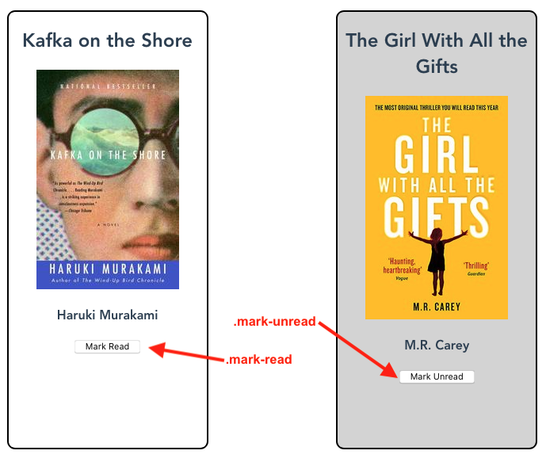

# Component Communication Exercise

In this exercise, you'll take an existing component and turn it into a group of components that communicate through a Vuex datastore. Throughout this exercise, you'll move data into a Vuex datastore, set up mutations, and create new components to interact with the data.

> Before you begin the exercise, run `npm install` to install any dependencies.

## Step One: Show reading list

First, take the following state and put it into the Vuex datastore located in `src/store/index.js`:
 
``` JSON
books: [
  {
    title: "Kafka on the Shore",
    author: "Haruki Murakami",
    read: false,
    isbn: "9781400079278"
  },
  {
    title: "The Girl With All the Gifts",
    author: "M.R. Carey",
    read: true,
    isbn: "9780356500157"
  },
  {
    title: "The Old Man and the Sea",
    author: "Ernest Hemingway",
    read: true,
    isbn: "9780684830490"
  },
  {
    title: "Le Petit Prince",
    author: "Antoine de Saint-Exupéry",
    read: false,
    isbn: "9783125971400"
  }
]
```

Implement the `ReadingList` component to take that data and create a `BookCard` component for each book. At this stage, you only need to create a `BookCard` component per book. Don't worry about showing anything on the `BookCard` yet.

These are the files you'll edit for this step:

- `src/component/ReadingList.vue`
- `src/store/index.js`

After you complete step one, run the end-to-end tests with the following command: `npm run test:e2e`.

You may notice that the Book Review page contains simply a title and four empty boxes.



All tests under "Step One Tests" now pass.

## Step Two: Display book details

Set up the `BookCard` to have a prop that takes a book and shows the details of that book in its UI: title, cover image, and author. The UI must use the provided classes in the CSS for the tests to work correctly:
|  | |
|------|--------|
| Book Title | `.book-title` |
| Book Author | `.book-author` |

> Note: The `img` tag to show the book cover using the book's ISBN has been provided, but commented out. You should remove the open and close tags at this time.

```html

```

Once you complete this step, all the tests under "Step Two Tests" pass.



## Step Three: Add a read/unread toggle button

Add a new control to the `BookCard` that's a button to toggle the read and unread status of a book. The button must indicate what clicking the button sets the status to. All books with a read status must have the `read` class added to the card.

Remember that the read status must be set through a mutation, not set directly from the `BookCard` component.

The button that sets the status to read must have a `mark-read` class, and the button that sets the status to unread must have a `mark-unread` class.

Once you complete this step, all tests under "Step Three Tests" pass.



## Step Four: Add a `NewBookForm` component

Create a new component that has a form for a user to add a new book to the list. The elements must have the following classes:

|  | |
|------|--------|
| Form | `.new-book-form` |
| Title Input Field | `.title-input` |
| Author Input Field | `.author-input` |
| ISBN Input Field | `.isbn-input` |


Lastly, add the component to the page in the `App` component.

Now, all tests pass.
