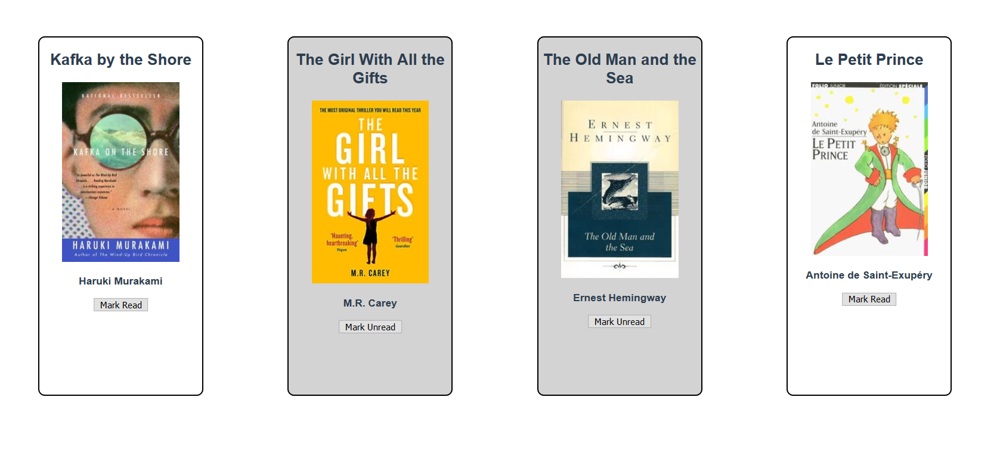
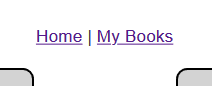
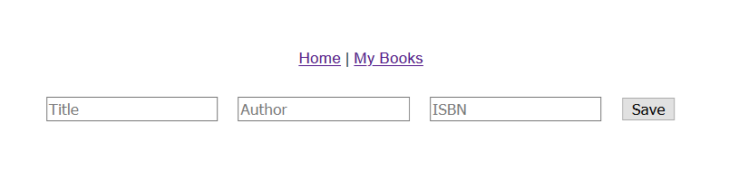
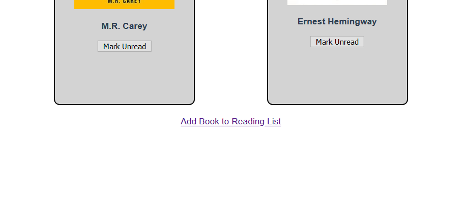
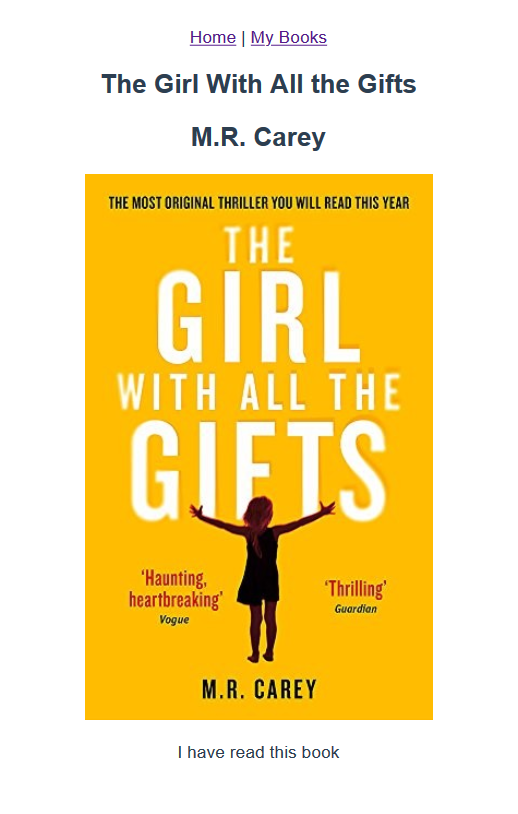
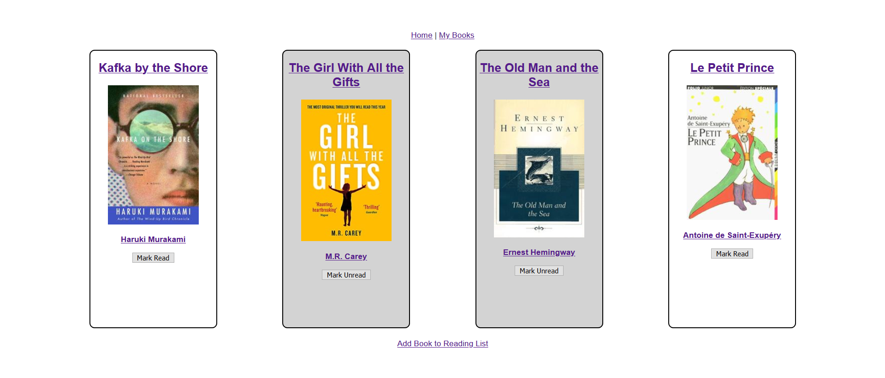

# Vue Router Exercise

In this exercise, you'll take components from the previous exercise and turn them into a full, single page application using the Vue Router. You may need to make some small changes to some of the existing components, but most of the work is done by creating views and setting their routes.

## Step One: Show a home page with best sellers and new releases

Implement a `Home` view that displays the `BestSellerList` and `NewReleasesList` components. Make this view appear when the path is `/`.

After you complete this step, all tests under "Step One Tests" pass.

## Step Two: Display the reading list

Implement a `MyBooks` view that displays the `ReadingList` component. Make this view appear when the path is `/myBooks`.

After you complete this step, all tests under "Step Two Tests" pass.

## Step Three: Implement navigation in the App component

Implement navigation in a `<nav>` element at the top of the `App` component. There must be a link to the `Home` view and a link to the `MyBooks` view.

After you complete this step, all tests under "Step Three Tests" pass.

## Step Four: Display the book form

Implement a `NewBook` view that displays the `NewBookForm` component at the path `/addBook`.

After you complete this step, all tests under "Step Four Tests" pass.

## Step Five: Integrate the new book form into application

Add a link to the bottom of the `MyBooks` view that links to the `NewBook` view. Also, change the submission logic of the `NewBookForm` component so that it goes back to the `MyBooks` view when a book is successfully added to the list.

> Hint: You need to change the `NewBookForm` component to do that navigation using the `this.$router` object.

After you complete this step, all tests under "Step Five Tests" pass.

## Step Six: Create a book detail view

Create a new component called `BookDetails` that shows all of a book's details on the screen. A basic version would be something like this:

Create a view and a dynamic route with the path `/book/` plus the `isbn` number on the end—for example, `/book/9781400079278`. Use that number to look up the book for the `BookDetails` component.

Finally, link the `BookCard` components in the `ReadingList` component to this new route, making sure to have the book's `isbn` as part of the link when the `BookCard` is clicked.

> Hint: Look at the `ReadingList` component to determine the source of the data you should use in the `BookDetails` component. Consider what array methods you know that return an element or elements with a specific value. `BookDetails` must receive a single `book` object.

After you complete this step, all tests now pass.
