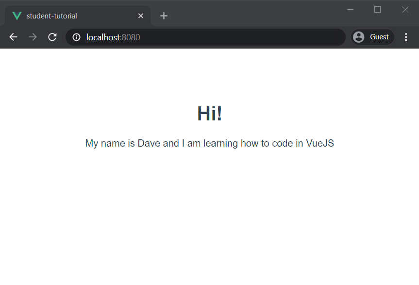
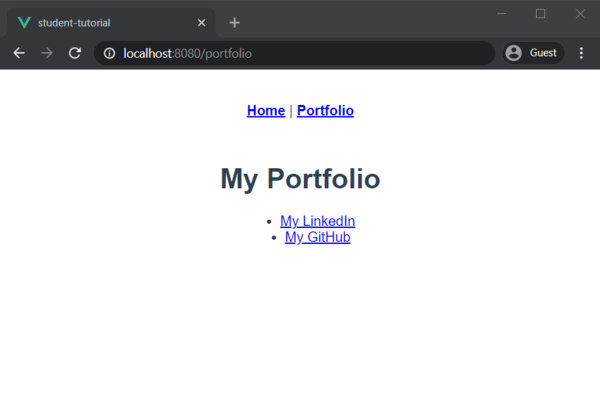
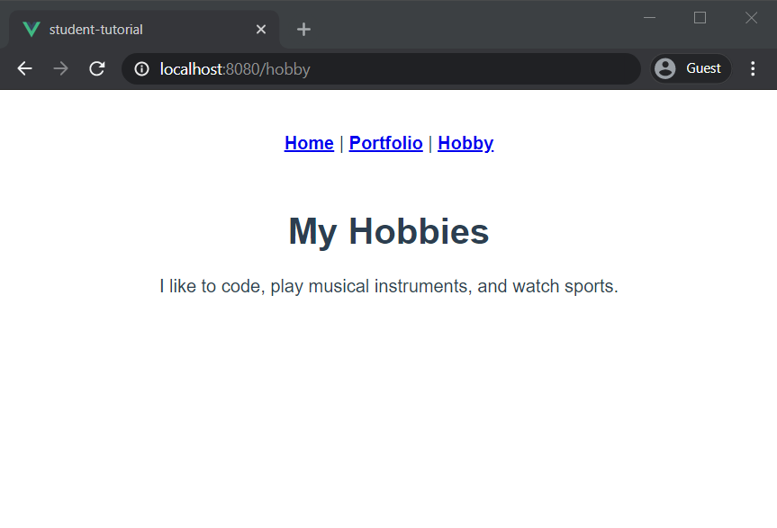
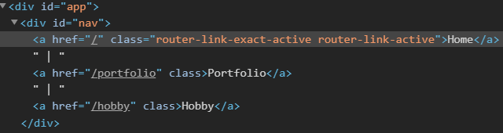
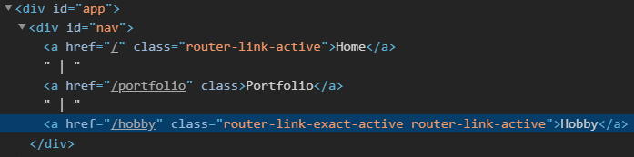
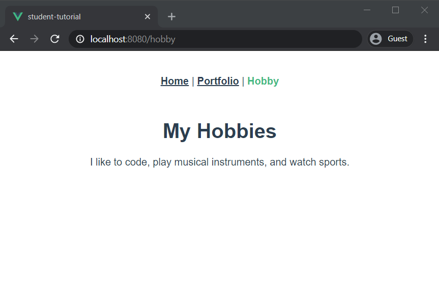

# VueJS Router Tutorial

In this tutorial, you'll work on using Vue Router to build a simple "About Me" site. You'll create three different views, their respective routes, and functional navigation. The starting point was created by `vue create` and selected to include `Router`.

## Step One: Implement a home page component

For the first step, you'll create the home page component, add its route, and add the `<router-view>` component to `App.vue`.

Start with creating a new component in the `src/views` directory and call the file `Home.vue`. In the new blank file, you can copy and paste the below code:

```html
<template>
  <div>
    <h1>Hi!</h1>
    <p>My name is [[your name here]] and I am learning how to code in VueJS</p>
  </div>
</template>
```

Switch over to `src/App.vue`. Remember that Vue Router pages are rendered in a `<router-view />` component? Add `<router-view />` to the `<template>` block just below the `<nav></nav>` element:

```html
<template>
  <div id="app">
    <nav>
    </nav>
    <router-view />
  </div>
</template>
```

Finally, open up `src/router/index.js`. You need to make two additions to this file. First, import the Home component, and then add a route for it. 

At the top of the file, after `import Vue` and `import VueRouter`, write the following:

```javascript
import Home from '../views/Home.vue'
```

In the `routes` object, you'll add the route for the home page. Remember that routes need at least two parts: the `path` and the `component` that it should load for that route. 

Also, keep in mind that it's a best practice to give a `name` to the route. This way, if anyone needs to make a change to the `path` or `component` in the future, it's easier than finding all the references to that link in your application. With that information, see if you can define the route before looking ahead at the solution:

```javascript
const routes = [
  {
    path: '/',
    name: 'home',
    component: Home
  }
]
```

Now try running the application. You can start it by typing `npm install` and then `npm run serve` in the terminal. If you don't see the bio/intro that you typed, check all the steps again and make sure you didn't miss anything. _Don't forget to save all files_. 

You should see something like the screenshot below:



## Step Two: Implement a portfolio page component

Like step one, you'll create another page and a route, but with the addition of adding the navigation to your site too. This page is your "portfolio" page where you'd write about your professional experience and show off some of your work, usually by linking to GitHub or another public repository.

Start with creating a new component in the `src/views` directory and call the file `Portfolio.vue`. In the new blank file, you can copy and paste the below code:

```html
<template>
  <div>
      <h1>My Portfolio</h1>
      <ul>
          <li><a href="https://www.linkedin.com/">My LinkedIn</a></li>
          <li><a href="https://github.com/">My GitHub</a></li>
      </ul>
  </div>
</template>
```

Switch over to `src/router/index.js` and add a route for the Portfolio page. Don't forget you need to import the component, too:

```javascript
import Portfolio from '../views/Portfolio.vue'
```

```javascript
const routes = [
  {
    path: '/',
    name: 'home',
    component: Home
  },
  {
    path: '/portfolio',
    name: 'portfolio',
    component: Portfolio
  }
]
```

Now that you have more than one page and routes set up for them, you need to add navigation to the site. How else would your users navigate the site?

Open `App.vue` and locate the `<nav>` element. You'll now add links to each of your two pages using `<router-link>` components. Remember that you're using named routes and that you won't put the actual URL to the page:

```HTML
<nav>
  <router-link v-bind:to="{name: 'home'}">Home</router-link> |
  <router-link v-bind:to="{name: 'portfolio'}">Portfolio</router-link>
</nav>
```

What this does is use the routes with the `name` of `home` and `portfolio` to generate the actual links when your page is rendered. Once you've completed this step, save all files, and try your site again. You should have something like below:



## Step Three: Implement a hobby page component

Next, you'll create another page and another route, and add it to the nav. This page is your "hobbies" page where you can write some information about an interest you have, such as playing a musical instrument, a sport you play, or a TV show you like.

Start by creating a new component in the `src/views` directory and call the file `Hobby.vue`. In the new blank file, you can copy and paste the below code:

```html
<template>
  <div>
      <h1>My Hobbies</h1>
      <p>I like to code, play musical instruments, and watch sports.</p>
  </div>
</template>
```

Switch over to `src/router/index.js` and add a route for the Hobby page. Don't forget you need to import the component, too:

```javascript
import Hobby from '../views/Hobby.vue'
```

```javascript
const routes = [
  {
    path: '/',
    name: 'home',
    component: Home
  },
  {
    path: '/portfolio',
    name: 'portfolio',
    component: Portfolio
  },
  {
    path: '/hobby',
    name: 'hobby',
    component: Hobby
  }
]
```

Finally, open up `App.vue` again and locate where you placed the other links in the last step. 

On a new line under the Portfolio link, add one for the Hobby page. You should also add a pipe character `|` after the Portfolio link like the Home page. This provides some visual separation between the links for the user:

```HTML
<nav>
  <router-link v-bind:to="{name: 'home'}">Home</router-link> |
  <router-link v-bind:to="{name: 'portfolio'}">Portfolio</router-link> |
  <router-link v-bind:to="{name: 'hobby'}">Hobby</router-link>
</nav>
```

Now save all your files again and open up your site. You should have something like below:



## Step Four: Style nav links

You might have noticed that your nav links have that default blue color, and after you visit the page the link is purple. Also, the nav doesn't indicate the page you are actively on. You should add some styling to these links.

### 1. Add the default color for all links

Open `App.vue` and scroll down to the `<style></style>` section. You should see a rule for `nav a`. This rule styles all `<a>` elements that are contained in a `<nav>` element. There's already a rule in there to make the text bold: `font-weight: bold`. This way, you can add some color to it with the `color` property. 

`color` can accept values in many different formats. You can just say `black` or `blue`, or you can use a hex value like `#2c3e50`, which is a very dark navy blue. Feel free to experiment with different values here.

```css
nav a {
  color: blue;
}
```
OR 
```css
nav a {
  color: #2c3e50;
}
```

Once you pick a color, save and see your changes. Now your links are the same color, regardless if you visited or not. But there's still no indication of the active page.

### 2. Style active link

When you went to the style section, you may have noticed there's a commented out block for `nav a.?????`. This is similar to the `#` denoting an id—the `.` denotes a class. But the class isn't filled in for you, as this is an exercise for you to investigate the rendered source and find the right class. 

Open your application in the browser, go to the Home page, right-click on the Home link, and select "Inspect" (Chrome) or "Inspect Element" (Firefox). You should see something like the screenshot below:



Notice there are two classes for the home link: `router-link-exact-active` and `router-link-active`. Now navigate to the Portfolio or Hobby page and see how the classes have changed. You may need to right-click and select "Inspect" again.



Now the Hobby page has the classes `router-link-exact-active` and `router-link-active`, but the Home page still has `router-link-active`. Why is this?

The `router-link-active` class is applied when the path matches wholly or partially with the route you are on. Imagine that you have another route that is `/portfolio/work`. Your link for `/portfolio` would be partially matched with `/portfolio/work` when you are on that page. This is useful in some circumstances when you have a complex navigation system. The Home route is `/`, so that ends up matching with every route on your site.

The `router-link-exact-active` class is applied when the path matches **exactly** with the route you are on. So that's the class that you should style.

Uncomment the style rule by removing the `/*` and `/*` characters. Replace the question marks with `router-link-exact-active`. In between the curly braces, add some style rules that help to distinguish the current page's link with the others. Perhaps removing the underline and setting the link to a different color helps:

```css
nav a.router-link-exact-active {
  text-decoration: none;
  color: #42b983;
}
```

Now you should see something like this depending on your color and other styling choices:



## Step Five: Change a route

Imagine that you want to change the path for your Hobby page to be `hobbies`. If this was a larger site and had links throughout the site that linked to the Hobby page, you'd have to do a "Find and Replace" and hope you didn't miss anything or cause any other problems. However, since you're using named routes, all you need to do is change one line in your router configuration file, `src/router/index.js`.

Open `src/router/index.js`. In the `routes` object, find where you defined the hobby path `/hobby` and change it to `/hobbies`:

```javascript
const routes = [
  {
    path: '/hobbies',
    name: 'hobby',
    component: Hobby
  }  
]
```

Save and reload your site. Now the Hobby link points to `/hobbies` and you only had to change one line.

## Summary

In this tutorial, you learned how to:

- Create `view`s for a VueJS application
- Define named routes for your application and understand why they are important if there are changes to your site's paths
- Create `<router-link>`s for navigation around your site
- Style the nav links and current page's link
