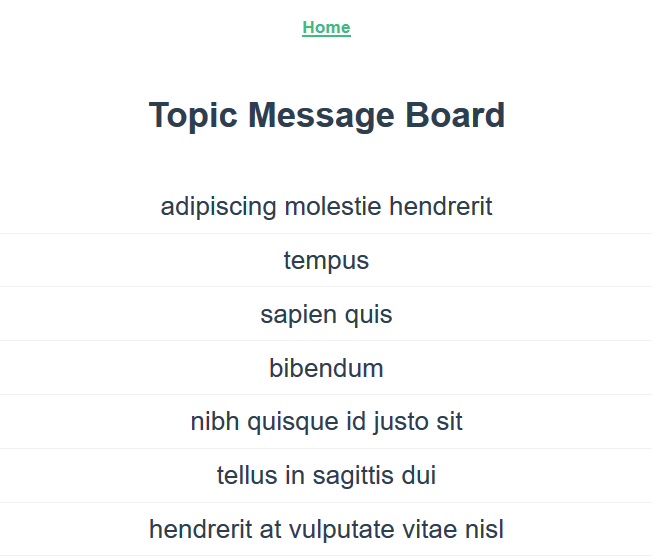
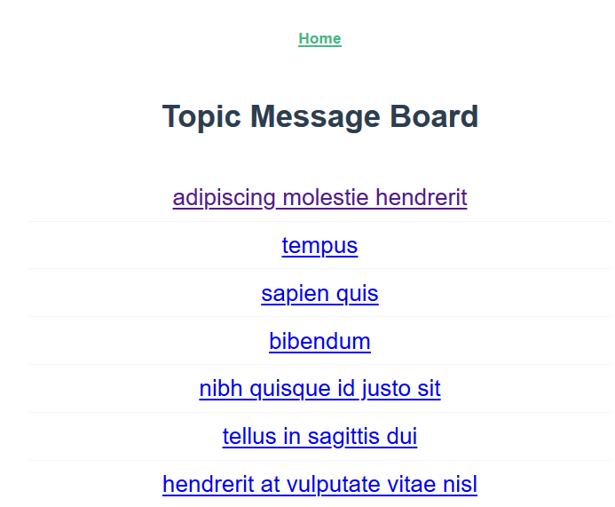
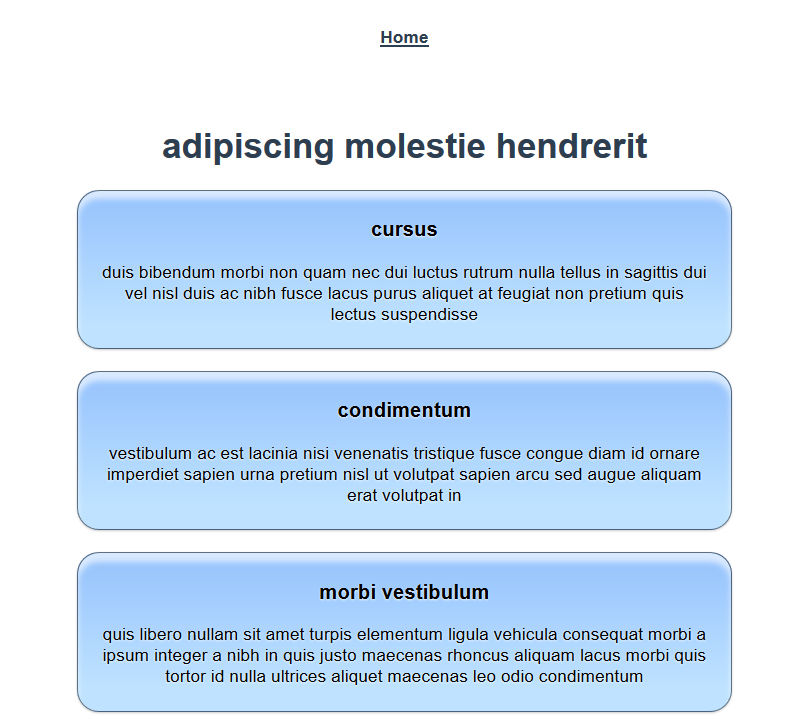

# Exercises for Web API (GET)

In this exercise, you'll build an application that displays topics, and messages in those topics, for a message board application. Most of the application has been completed. You need to implement a new service object to connect to the web API, and use that service object in the components to pull in data from the API.

## Step One: Initialize the project 

After opening the project folder in Visual Studio Code, open the View menu and click on Terminal. Alternatively, you may press `` Ctrl+` `` on Windows and macOS. Next, run the command `npm install` to install any dependencies before working on the project.

To run the project, use `npm run serve`.

To test the project and verify completion, use `npm run test:e2e`.

## Step Two: Implement Service Object and Retrieval of Topics

Create a new service object to use against the Topics Web API. This service object should have the base URL set to `http://localhost:3000`.

Add a method that calls the URL `/topics` and returns the Promise. Check that URL in Postman to see what format the data is in.

## Step Three: Load the Topic data into the `TopicList` component

Update the `TopicList` component to use the service object to load in the topic data, and set it to the component's `topic` data property.

This creates a view that looks like this:

After this step is complete, all tests in `Step Three Tests` should pass.

## Step Four: Load the details for a specific topic

Add a new method to the service object that pulls information from the URL `/topics/:id` and returns a Promise. Check that URL in Postman to see what format the data is in.

Update the `TopicDetails` component to use that new method to update its data.

Update the `TopicList` component to add links to the topic name that go to the `Messages` route. Look at the router configuration in `src/router/index.js` to see the route details.

The page at `/` now looks like this:

The topic details at those links look like this:

After this step, all tests should pass.