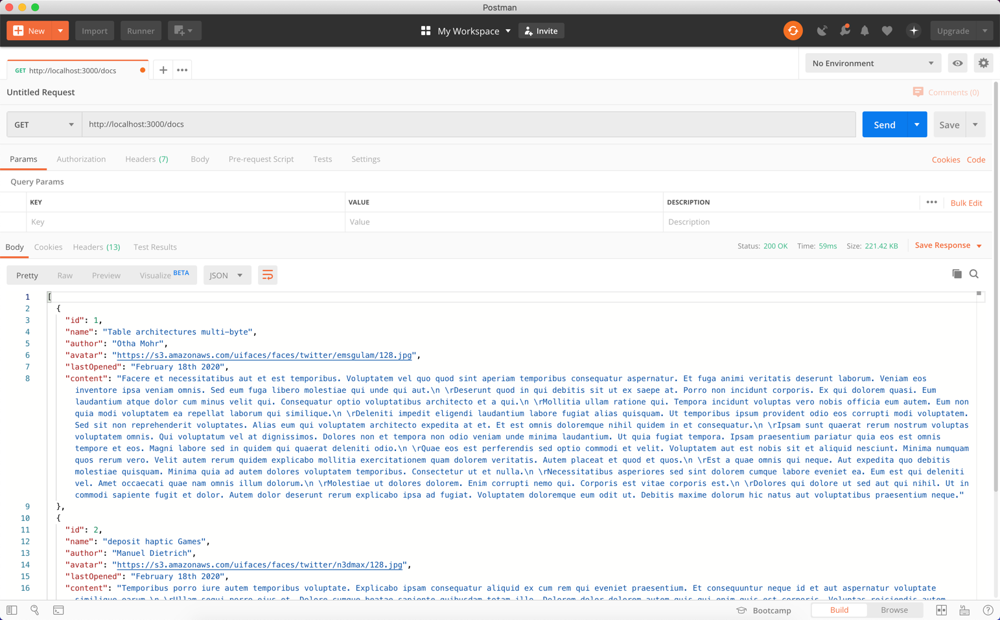
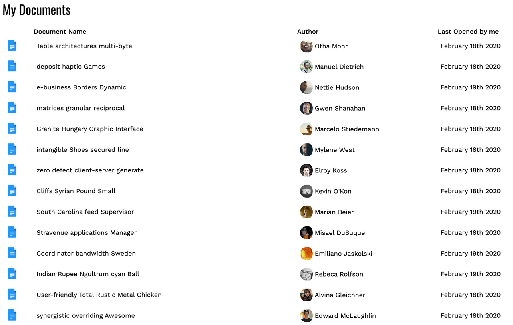
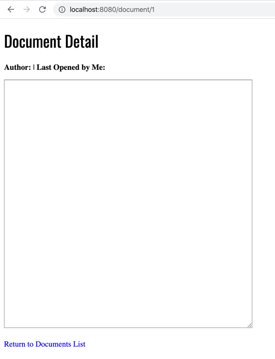
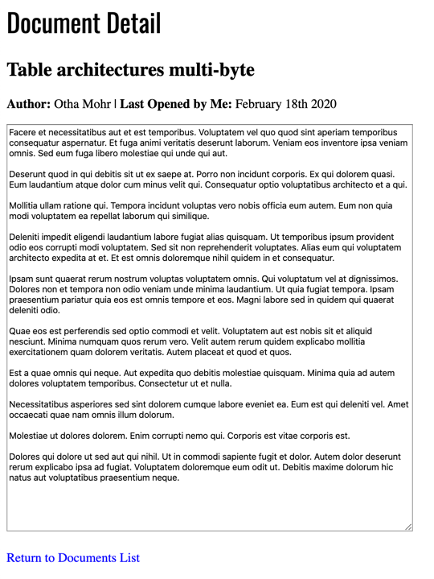

# Web Services (GET): Tutorial (Javascript)

In this tutorial, you'll work on a document listing application. Most of the functionality to render data is in the starting code. You're responsible for calling the Web API to retrieve a list of documents and details for each one.

## Step One: Run the project

The first thing to do is install any dependencies by running the command `npm install`. If you run the project using the command `npm run serve`, the Vue application starts normally on port 8080. The `serve` command also starts up a local Web API on port 3000.

## Step Two: Explore the web API 

Before moving on to the next step, explore the web API using Postman. You can access the following endpoints:

- GET: http://localhost:3000/docs
  - A list of all documents.
- GET: http://localhost:3000/docs/1
  - Details for a document using the document id.
  - There are 100 documents, each with an id.



## Step Three: Review starting code 

Before you get started with the tutorial, take a minute to review the starting code. If you look at `/src/router/index.js`, there are two routes set up for `Home` and `Document`:

```js
const routes = [
  {
    path: '/',
    name: 'Home',
    component: Home
  },
  {
    path: '/document/:id',
    name: 'Document',
    component: Document
  }
]
```

The home view `/src/views/Home.vue` imports and uses the `/src/components/DocumentList` component. This component has all the code necessary to render an array of document objects. 

The `docs` array is currently empty, so your first task is to set up a service object and retrieve a list of documents to populate that array.

## Step Four: Create document service object

You need a document service object to retrieve a list of documents. Start by creating a new folder under `src` called `services` and create a new file called `DocsService.js`. You'll start by importing `axios` and setting the `baseURL`:

```js
import axios from 'axios';

const http = axios.create({
  baseURL: "http://localhost:3000"
});
```

Next, you'll export a default object that has a single method called `list()`. This method uses axios to call the document's Web API and return a [`Promise`](https://developer.mozilla.org/en-US/docs/Web/JavaScript/Reference/Global_Objects/Promise):

```js
import axios from 'axios';

const http = axios.create({
  baseURL: "http://localhost:3000"
});

export default {

  list() {
    return http.get('/docs');
  }

}
```

With the `DocsService` file in place, you need to use it inside of the document list component. Open up `/src/components/DocumentList.vue` and import the `DocsService` that you just created:

```js
import docsService from "../services/DocsService";

export default {
  name: "document-list",
  data() {
    return {
      docs: []
    };
  },
  methods: {
    viewDocument(id) {
      this.$router.push(`/document/${id}`);
    }
  }
};
```

Next, use the `created()` lifecycle hook to call the `list()` method in `DocsService`. The `list()` method returns a promise, and when it resolves, you can set the `docs` array to the response:

```js
import docsService from "../services/DocsService";

export default {
  name: "document-list",
  data() {
    return {
      docs: []
    };
  },
  methods: {
    viewDocument(id) {
      this.$router.push(`/document/${id}`);
    }
  },
  created() {
    docsService.list().then((response) => {
      this.docs = response.data;
    });
  }
};
```

If you visit http://localhost:8080, you should see a list of documents:



If you hover over a table row, you'll notice that it gets highlighted. If you click on the row, the method `viewDocument()` is called, which uses Vue Router to navigate to the details for that document:

```html
<tr v-for="doc in docs" :key="doc.id" v-on:click="viewDocument(doc.id)">
```

```js
viewDocument(id) {
  this.$router.push(`/document/${id}`);
}
```

## Step Five: Create method to display document details

If you click on the first document from the home view, you are sent to http://localhost:8080/document/1. Right now, the document detail page has no details:



If you look at the router configuration, there's a route that matches that path. This loads the document view `/src/views/Document`, which uses the `/src/components/DocumentDetail` component:

```js
  {
    path: '/document/:id',
    name: 'Document',
    component: Document
  }
```

The `DocumentDetail` component has the functionality to render the details for a document. To render those details, you need to create a new method in your `DocsService` object and call it from your `DocumentDetail` component.

First, open up `/src/services/DocsService.js` and add a new method that retrieves a single document by its id:

```js
import axios from 'axios';

const http = axios.create({
  baseURL: "http://localhost:3000"
});

export default {

  list() {
    return http.get('/docs');
  },

  get(id) {
    return http.get(`/docs/${id}`)
  }

}
```

Next, open up `/src/component/DocumentDetail.vue` and import the `DocsService`:

```js
import docsService from "../services/DocsService";

export default {
  name: "document-detail",
  data() {
    return {
      document: {
        id: null,
        name: "",
        author: "",
        lastOpened: null,
        content: ""
      }
    };
  }
};
```

Finally, use the `created()` method lifecycle hook to call the `get()` method in `DocsService`. Set the component's document property equal to the response of the Web API call:

```js
import docsService from "../services/DocsService";

export default {
  name: "document-detail",
  data() {
    return {
      document: {
        id: null,
        name: "",
        author: "",
        lastOpened: null,
        content: ""
      }
    };
  },
  created() {
    docsService.get(this.$route.params.id).then((response) => {
      this.document = response.data;
    });
  }
};
```

If you run the application, you should be able to see the list documents and then click on one to view the details for that document:



Congratulations, you just hooked up your first Web API to a Vue application.

## Summary

In this tutorial, you learned how to:
- Make an HTTP GET request to a Web API using the Axios library.
- Handle the response (Promise) of a Web API request.
- Build a service object for interacting with a Web API.
- Use the `created()` lifecycle hook to call a Web API and retrieve data when the view is rendered.
