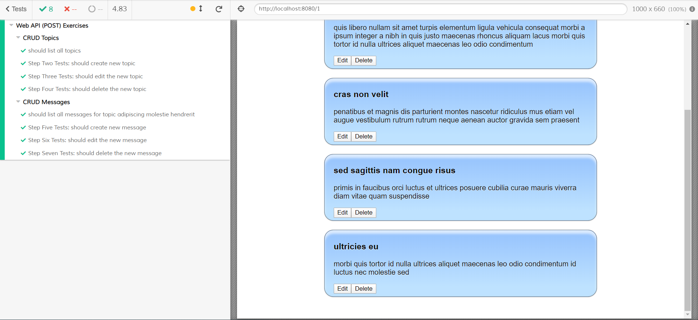

# Exercises for Web API (POST)

In this exercise, you'll continue working with the application that displays topics and messages in those topics. The only major change to the application is it was refactored to use Vuex to manage state. 

You'll use the application as an administrator where you can create, read, update and delete both topics and messages.

## Before you begin: Initialize the project

After opening the project folder in Visual Studio Code, open the View menu and click on Terminal. Alternatively, you may press `` Ctrl+` `` on Windows and macOS. Next, run the command `npm install` to install any dependencies before working on the project.

To run the project, use `npm run serve`.

To test the project and verify completion, use `npm run test:e2e`.

## Part One: CRUD Topics

All of the service methods for topics are created in `/src/services/TopicService.js`.

### Step One: Create a new Topic

Add a new method to the service object that accepts a topic as an argument, performs a `POST` request to the URL `/topics`, and returns a Promise. Use Postman to perform a `POST` request to `/topics` and make sure the service endpoint works before moving on.

Next, open `/src/components/CreateTopic.vue`. You'll see that the `saveTopic()` method is empty. You'll need to call the method you created in `TopicService`. 

When the promise is returned, check the status code to make sure the new topic was created (201), and then use the router to forward the user to `/`.

### Step Two: Update a Topic

Add a new method to the service object that accepts a topic id and topic as arguments, performs a `PUT` request to the URL `/topics/:id`, and returns a Promise. Use Postman to perform a `PUT` request to `/topics/:id` and make sure the service endpoint works before moving on.

Open `/src/components/UpdateTopic.vue`. You'll see that the `updateTopic()` is missing a call to the service. You'll need to call the method you just created in `TopicService`. 

When the promise is returned, check the status code to make sure everything was successful (200) and then use the router to forward the user to `/`.

### Step Three: Delete a Topic

Add a new method to the service object that accepts a topic id, performs a `DELETE` request to the URL `/topics/:id`, and returns a Promise. Use Postman to perform a `DELETE` request to `/topics/:id` and make sure the service endpoint works before moving on.

Open `/src/components/TopicList.vue`. You'll see that the `deleteTopic(id)` is empty. You'll need to call the method you created in `TopicService`. 

When the promise is returned, check the status code to make sure everything was successful (200), and call `this.getTopics()` to refresh the list of topics.

After this step is complete, all tests in `Step Two Tests`, `Step Three Tests`, and `Step Four Tests` should pass.

>Note: if your tests fail and you receive the error message "Too many elements found", you may need to reset the test database by running `git checkout db/readit-test.json`.

## Part Two: CRUD Messages

All of the service methods for messages will be created in `/src/services/MessageService.js`.

### Step One: Create a new Message

Add a new method to the service object that accepts a message as an argument, performs a `POST` request to the URL `/messages`, and returns a Promise. Use Postman to perform a `POST` request to `/messages`, and make sure the service endpoint works before moving on.

Open `/src/components/CreateMessage.vue`. You'll see that the `saveMessage()` method is empty. You'll need to call the method you created in `MessageService`. 

When the promise is returned, check the status code to make sure the new topic was created (201), and then use the router to forward the user to `/${message.topicId}`.

### Step Two: Update a Message

Add a new method to the service object that accepts a message id and message as arguments, performs a `PUT` request to the URL `/messages/:id`, and returns a Promise. Use Postman to perform a `PUT` request to `/messages/:id`, and make sure the service endpoint works before moving on.

Open `/src/components/UpdateMessage.vue`. You'll see that the `updateMessage()` is missing a call to the service. You'll need to call the method you created in `MessageService`. 

When the promise is returned, check the status code to make sure everything was successful (200), and then use the router to forward the user to `/${message.topicId}`.

### Step Three: Delete a Message

Add a new method to the service object that accepts a topic id, performs a `DELETE` request to the URL `/messages/:id`, and returns a Promise. Use Postman to perform a `DELETE` request to `/messages/:id` and make sure the service endpoint is working before moving on.

Open `/src/components/TopicDetails.vue`. You'll see that the `deleteMessage(id)` is empty. You need to call the method you created in `MessageService`. When the promise is returned, check the status code to make sure everything was successful (200), and commit a mutation to the Vuex Store:

```js
this.$store.commit("DELETE_MESSAGE", id);
```

After this step is complete, all tests in `Step Five Tests`, `Step Six Tests`, `Step Seven Tests` should pass.

>Note: if your tests fail and you receive the error message "Too many elements found", you may need to reset the test database by running `git checkout db/readit-test.json`.

After this step, all tests should pass.


