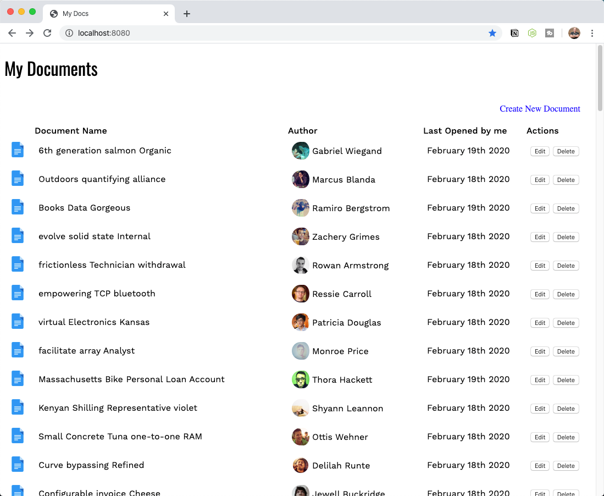

# Web Services (POST): Tutorial (Javascript)

In this tutorial, you'll work with the document listing application that you saw in a previous tutorial. The application has been modified to use Vuex, but other than that, it should be familiar to you.

## Step One: Run the project

The first thing to do is install any dependencies by running the command `npm install`. If you run the project using the command `npm run serve`, the Vue application starts normally on port 8080. The `serve` command also starts up a local Web API on port 3000.

## Step Two: Create a new document

Your first task is to create a new document. If you're on the home page where you see a list of documents, there is a `Create New Document` link in the upper right-hand corner:



If you click the link, you'll see a form that has all the fields needed to create a new document. When you click on the cancel button, it returns you to the list of the documents. When you click the save button, the new document needs to be sent to the API to be saved. This is what you're going to work on now.

Open `/src/services/DocsService.js` and add a method to take the document as an argument, and `POST` it to your API using Axios:

```js
create(doc) {
  return http.post(`/docs/`, doc);
}
```

Next, open up the `AddDocument (/src/components/AddDocument.vue)` component. When the save button is clicked, the `saveDocument()` method is called. Right now, it doesn't do anything:

```html
<button type="submit" v-on:click="saveDocument()">Save Document</button>
```

The `saveDocument()` method needs to call the `DocsService.create()` method that you created. To do that, you need to import the `DocsService` first:

```js
import docsService from '../services/DocsService';

export default {
  // ...
};
```

You'll the `create()` method with `this.document` as an argument. When the response comes, you can check to the status code to make sure the document was saved—meaning, returns a 201 Status Code—to your API.

```js
saveDocument() {
  docsService
    .create(this.document)
    .then((response) => {
      if (response.status === 201) {
        this.$router.push("/");
      }
    })
},
```

Enter a name, author, and content and click save. You should be redirected to the home page with the most recent document being displayed first. Now you know how to use Axios to `POST` a new document to your API.

## Step Three: Update an existing document

Next, you'll allow users to update an existing document. When you're on the home page, there is an edit button in the table row for each document. When you click on this button, you're sent to the `Document` view which uses the `DocumentDetail` component.

When you click on the `Save Document` button, the `saveDocument()` method is called. At the moment, it doesn't do anything:

```html
<button type="submit" v-on:click="saveDocument()">Save Document</button>
```

In `DocsService`, you need to add a method named `update(id, doc)` that takes the id of the document that you want to update along with the document object that contains all of the property/values of the document. This method uses Axios to send a `PUT` request to your API:

```js
update(id, doc) {
  return http.put(`/docs/${id}`, doc);
},
```

The only property you're updating here is the content, but you'll send the entire document object to the API. So, you'll construct one in the `saveDocument()` method. When the `update()` method's promise is fulfilled, you'll want to verify that the response status is OK and forward the user back to `/`:

```js
saveDocument() {
  const current = this.$store.state.activeDocument;
  const doc = {
    id: current.id,
    name: current.name,
    author: current.author,
    avatar: current.avatar,
    content: this.content,
    lastOpened: current.lastOpened
  };
  docsService.update(doc.id, doc).then(response => {
    if (response.status === 200) {
      this.$router.push("/");
    }
  });
}
```

> Why can't I just update `this.$store.state.activeDocument`? You could, but you would need to create a mutation. You're forwarding to the `/` route where the list of documents is updated from the API, so you don't need to create a mutation.

If you change the content field and click "save", it should update and redirect you back to the home page.

## Step Four: Delete a document

The last feature you need to support is the ability to delete a document. If you look at the list of documents, you'll see a delete button in the Actions column for each document. When you click on the delete button, the `deleteDocument()` method is called and passed the document id:

```html
<button v-on:click="deleteDocument(doc.id)">Delete</button>
```

In `DocsService`, you'll need to add a method named `delete(id)` that takes the id of the document that you want to delete. This method uses Axios to send a `DELETE` request to your API:

```js
delete(id) {
  return http.delete(`/docs/${id}`);
}
```

In your `deleteDocument()` method, you need to replace the existing `console.log(id)` with a call to this new method, which verifies that the response returns a status code of 200. This indicates that the document was deleted, but you still see it in your list of documents. This is because you need to "refresh" the current list of documents. To do this, call your API to get an updated list of documents:

```js
deleteDocument(id) {
  // Replace console.log(id) with the following
  docsService
    .delete(id)
    .then(response => {
      if (response.status === 200) {
        this.getDocuments();
      }
    });
}
```

## Step Five: Error handling

Everything you have done so far has worked without error. However, in the real world, you need to be prepared to handle any kind of error.

When you click on the edit button to make changes to a document, the `DocumentDetail` component loads the active document by looking at the id in the URL. But what happens if you update the document id to something that you know doesn't exist, like http://localhost:8080/document/23432432?

If you said a document with no information would be presented to the user, you're correct.

To catch this type of error, you'll need to add some error handling to the API call. If you catch an error and the status code is 404—meaning Not Found—redirect the user to the path `/404`, which loads `/src/views/NotFound`:

```js
created() {
  docsService
    .get(this.$route.params.id)
    .then(response => {
      this.$store.commit("SET_ACTIVE_DOCUMENT", response.data);
    })
    .catch(error => {
      if (error.response.status === 404) {
        this.$router.push("/404");
      } else {
        console.error(error);
      }
    });
}
```

Another scenario that might come up is if two people are looking at the same list of documents. What would happen if one of them deleted a document and the other tried to delete it? You'll want to add some similar error handling to the `deleteDocument()` API:

```js
deleteDocument(id) {
  docsService
    .delete(id)
    .then(response => {
      if (response.status === 200) {
        this.getDocuments();
      }
    })
    .catch(error => {
      if (error.response.status === 404) {
        this.$router.push("/404");
      } else {
        console.error(error);
      }
    });
},
```

## Summary

In this tutorial, you learned how to:

- POST: Create a new resource by using Axios to POST to your API.
- PUT: Update an existing resource by using Axios to call PUT on your API.
- DELETE: Delete an existing resource by using Axios to call DELETE on your API.
- Use Axios to handle errors.
